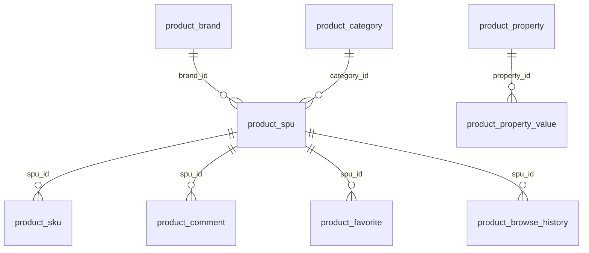

# 系统架构：商城商品中心（后端）

证据来源：entries/backend-package-yudao-module-product/{architecture,business-flows,data-model,error-handling}.md
入口：1 个（backend-package-yudao-module-product）
源码范围：ruoyi-vue-pro/yudao-module-mall/yudao-module-product/**

---

## 1. 系统总览

本系统是"商城"模块下"商品中心"的后端 Spring Boot 模块，提供商品中心全生命周期的管理能力：
- 商品 SPU/SKU 的发布、编辑、上下架
- 商品分类、品牌、属性项、属性值的字典维护
- 商品评价、用户收藏、浏览历史
- 跨模块的 RPC 暴露，被订单、营销、装修等模块消费

对应包前缀 `cn.iocoder.yudao.module.product`，采用 yudao 标准四层架构 + 跨模块 RPC 模式。

## 2. 入口清单

| 入口 ID | 类型 | 源码范围 | 文件数 | 节点数 | 可分析符号 |
|---|---|---|---|---|---|
| backend-package-yudao-module-product | backend_package | yudao-module-mall/yudao-module-product/** | 128 | 2132 | 488 |

## 3. 分层架构

```
┌─────────────────────────────────────────────────────────┐
│  Controller  layer (admin + app)                        │
│  - 53 admin endpoints + 12 app endpoints                │
│  - @PreAuthorize、@Valid、@ApiAccessLog                │
└───────────────────────────┬─────────────────────────────┘
                            │ 注入 Service
┌───────────────────────────▼─────────────────────────────┐
│  Service     layer (9 interfaces + 9 impls)             │
│  - 业务编排、@Transactional、循环依赖解耦（@Lazy）        │
│  - 169 service_method 覆盖 7 大子域                      │
└───────────────────────────┬─────────────────────────────┘
                            │ 注入 Mapper
┌───────────────────────────▼─────────────────────────────┐
│  Repository  layer (9 MyBatis-Plus Mappers)              │
│  - LambdaQueryWrapperX、分页、批量操作                   │
│  - 40 repository_method                                  │
└───────────────────────────┬─────────────────────────────┘
                            │ 映射
┌───────────────────────────▼─────────────────────────────┐
│  Entity      layer (9 DOs)                               │
│  - @TableName、@KeySequence、TypeHandler                 │
└─────────────────────────────────────────────────────────┘
辅助：Convert（5 个 MapStruct）+ api/（4 个 RPC）
```

## 4. 子域划分

| 子域 | 主要类 | 端点数 | RPC 数 | 关键能力 |
|---|---|---|---|---|
| 商品 SPU/SKU | ProductSpuController、ProductSpuService、ProductSpuDO、ProductSkuService、ProductSkuDO | 9 + 内部 SKU | 4 | 5-Tab 状态、复合表单、价格汇总 |
| 商品分类 | ProductCategoryController、ProductCategoryService、ProductCategoryDO | 5 | 5 | 树形管理、层级校验、级联保护 |
| 商品品牌 | ProductBrandController、ProductBrandService、ProductBrandDO | 7 | 0 | 名称唯一性、状态管理 |
| 商品属性 | ProductPropertyController、ProductPropertyValueController、ProductPropertyDO、ProductPropertyValueDO | 12 | 0 | 两级字典、值级联校验 |
| 商品评价 | ProductCommentController、ProductCommentService、ProductCommentDO | 4 | 7 | 评价、回复、可见性 |
| 收藏与历史 | AppFavoriteController、AppProductBrowseHistoryController、ProductFavoriteDO、ProductBrowseHistoryDO | 16 | 0 | App 端用户行为 |
| 跨模块 RPC | 4 Api + 4 ApiImpl | 0 | 20 | 对外暴露商品能力 |

## 5. 跨模块集成

### 5.1 上游依赖

- yudao-framework：CommonResult、PageResult、BaseDO、ErrorCode、TypeHandler
- yudao-module-member：MemberUserApi（获取用户昵称/头像）
- yudao-module-system：DictDataApi（字典项查询）

### 5.2 下游消费

- yudao-module-promotion：CouponTemplateServiceImpl.validateProductScope → ProductCategoryApi.validateCategoryList
- yudao-module-promotion：RewardActivityServiceImpl.validateProductScope → ProductCategoryApi.validateCategoryList
- yudao-module-trade：TradeOrderUpdateServiceImpl → ProductCommentApi.createComment
- yudao-module-trade：订单创建/取消 → ProductSkuApi.updateSkuStock
- yudao-module-bpm：流程编排 → ProductSpuApi.validateSpuList
- yudao-module-mall-promotion：营销活动 → ProductCategoryApi、ProductSpuApi

## 6. 数据模型总览

详见 [data-model.md](data-model.md)。核心表：



9 张表 + 24 个唯一/索引约束 + Jackson JSON 字段类型。

## 7. 状态机总览

详见 [state-machines.md](state-machines.md)。5 类状态机：

1. **SPU 销售状态**（RECYCLE -1 / DISABLE 0 / ENABLE 1）
2. **分类层级**（顶级 / 一级 / 二级 / 非法）
3. **评价可见性**（visible × replyStatus）
4. **通用启用/禁用**（0 / 1）
5. **SKU 规格类型**（单规格 / 多规格）

## 8. 错误处理总览

详见 [error-handling.md](error-handling.md)。分层错误处理 + 24 条业务错误码：

- Controller 层：@Valid 参数校验、@PreAuthorize 权限校验
- Service 层：业务异常抛出、@Transactional 事务回滚
- Repository 层：数据库唯一索引兜底
- 错误码段：1-008-000-000 ~ 1-008-008-001（8 组）

## 9. 技术选型

| 维度 | 选型 |
|---|---|
| 运行时 | JDK 17+ |
| Web | Spring MVC |
| 安全 | Spring Security |
| ORM | MyBatis-Plus |
| 事务 | Spring @Transactional |
| 校验 | Jakarta Validation |
| 映射 | MapStruct |
| 工具 | Lombok + Hutool + Guava |
| 文档 | Swagger v3 |
| 缓存 | Redis（框架级） |
| 序列化 | Jackson |
| 监控 | Micrometer + Prometheus |

## 10. 部署与扩展

详见 [technical-architecture.md](entries/backend-package-yudao-module-product/technical-architecture.md)。

- 启动方式：Spring Boot、mvn、Docker
- 扩展点：多租户、读写分离、分布式事务（Seata）、消息队列
- 性能优化：N+1 修复、批量操作、Redis 缓存、读写分离

## 11. source_nodes 追溯

- 128 个源文件
- 2132 个原生节点
- 488 个可分析符号
- 25 个语义分类
- 完整证据：evidence/backend-package-yudao-module-product/{inventory,nodes,typecards}.json
