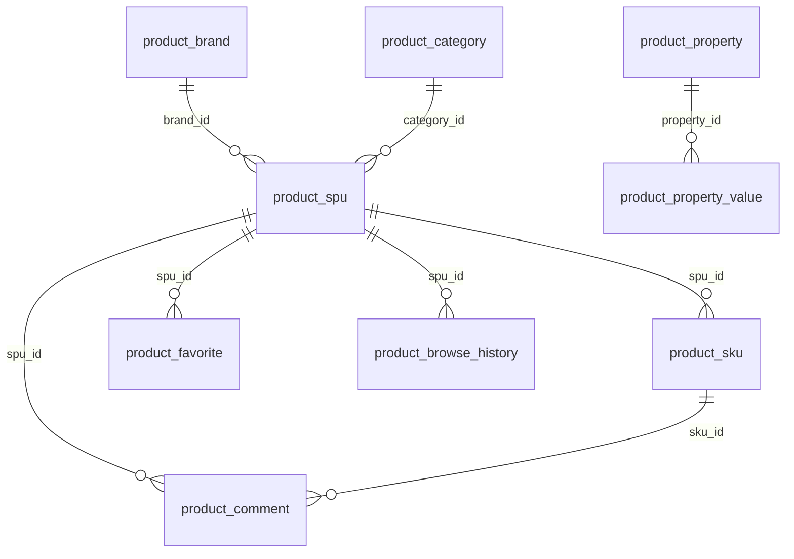

# 数据库视图：商城商品中心后端 (backend-package-yudao-module-product)

入口 ID：backend-package-yudao-module-product
证据：evidence/backend-package-yudao-module-product/{nodes,typecards}.json
覆盖：9 个核心表 + 关系 + 索引 + 缓存策略

---

## 1. 表清单

| 表名 | 实体 | 用途 | 数据量级 |
|---|---|---|---|
| product_brand | ProductBrandDO | 商品品牌 | 千级 |
| product_category | ProductCategoryDO | 商品分类（树） | 百级 |
| product_spu | ProductSpuDO | 商品 SPU | 十万级 |
| product_sku | ProductSkuDO | 商品 SKU | 百万级 |
| product_property | ProductPropertyDO | 商品属性项 | 百级 |
| product_property_value | ProductPropertyValueDO | 商品属性值 | 千级 |
| product_comment | ProductCommentDO | 商品评价 | 百万级 |
| product_favorite | ProductFavoriteDO | 商品收藏 | 千万级 |
| product_browse_history | ProductBrowseHistoryDO | 浏览历史 | 千万级 |

## 2. 表结构

### 2.1 product_spu（商品 SPU 表）

```sql
CREATE TABLE product_spu (
    id              BIGINT          NOT NULL    COMMENT 'SPU编号',
    name            VARCHAR(128)    NOT NULL    COMMENT '商品名称',
    keyword         VARCHAR(256)                COMMENT '关键字',
    introduction    VARCHAR(512)                COMMENT '商品简介',
    description     TEXT                        COMMENT '商品详情',
    category_id     BIGINT          NOT NULL    COMMENT '分类编号',
    brand_id        BIGINT                      COMMENT '品牌编号',
    pic_url         VARCHAR(512)                COMMENT '封面图',
    slider_pic_urls JSON                        COMMENT '轮播图',
    sort            INT             DEFAULT 0   COMMENT '排序',
    status          TINYINT         NOT NULL    COMMENT '状态：-1=回收站、0=下架、1=上架',
    spec_type       TINYINT         NOT NULL    COMMENT '规格类型：false=单规格、true=多规格',
    price           INT             NOT NULL    COMMENT '销售价（分）',
    market_price    INT                         COMMENT '市场价（分）',
    cost_price      INT                         COMMENT '成本价（分）',
    stock           INT             DEFAULT 0   COMMENT '库存',
    delivery_types  VARCHAR(255)                COMMENT '配送方式（逗号分隔）',
    delivery_template_id BIGINT                 COMMENT '物流模板编号',
    give_integral   INT             DEFAULT 0   COMMENT '赠送积分',
    sub_commission_type TINYINT                 COMMENT '分销类型',
    sales_count     INT             DEFAULT 0   COMMENT '销量',
    virtual_sales_count INT         DEFAULT 0   COMMENT '虚拟销量',
    browse_count    INT             DEFAULT 0   COMMENT '浏览量',
    create_time     DATETIME        NOT NULL    COMMENT '创建时间',
    update_time     DATETIME        NOT NULL    COMMENT '更新时间',
    create_by       BIGINT                      COMMENT '创建人',
    update_by       BIGINT                      COMMENT '更新人',
    deleted         BIT             DEFAULT 0   COMMENT '逻辑删除',
    PRIMARY KEY (id)
);
```

**索引**：
- PRIMARY KEY (id)
- INDEX idx_category_id (category_id)
- INDEX idx_brand_id (brand_id)
- INDEX idx_status (status)
- INDEX idx_sort (sort)
- INDEX idx_create_time (create_time)

### 2.2 product_sku（商品 SKU 表）

```sql
CREATE TABLE product_sku (
    id                      BIGINT          NOT NULL    COMMENT 'SKU编号',
    spu_id                  BIGINT          NOT NULL    COMMENT 'SPU编号',
    properties              JSON                        COMMENT '规格属性JSON',
    price                   INT             NOT NULL    COMMENT '销售价（分）',
    market_price            INT                         COMMENT '市场价（分）',
    cost_price              INT                         COMMENT '成本价（分）',
    stock                   INT             DEFAULT 0   COMMENT '库存',
    weight                  DECIMAL(10,2)               COMMENT '重量（克）',
    volume                  DECIMAL(10,2)               COMMENT '体积（立方厘米）',
    first_brokerage_price   INT                         COMMENT '一级分销佣金（分）',
    second_brokerage_price  INT                         COMMENT '二级分销佣金（分）',
    pic_url                 VARCHAR(512)                COMMENT 'SKU图片',
    create_time             DATETIME        NOT NULL,
    update_time             DATETIME        NOT NULL,
    create_by               BIGINT,
    update_by               BIGINT,
    deleted                 BIT             DEFAULT 0,
    PRIMARY KEY (id)
);
```

**索引**：
- PRIMARY KEY (id)
- INDEX idx_spu_id (spu_id)

### 2.3 product_category（商品分类表）

```sql
CREATE TABLE product_category (
    id          BIGINT          NOT NULL    COMMENT '分类编号',
    parent_id   BIGINT          NOT NULL    COMMENT '父分类编号（0=顶级）',
    name        VARCHAR(64)     NOT NULL    COMMENT '分类名称',
    pic_url     VARCHAR(512)                COMMENT '分类图片',
    sort        INT             DEFAULT 0   COMMENT '排序',
    status      TINYINT         NOT NULL    COMMENT '状态：0=禁用、1=启用',
    create_time DATETIME        NOT NULL,
    update_time DATETIME        NOT NULL,
    create_by   BIGINT,
    update_by   BIGINT,
    deleted     BIT             DEFAULT 0,
    PRIMARY KEY (id)
);
```

**索引**：
- PRIMARY KEY (id)
- INDEX idx_parent_id (parent_id)
- INDEX idx_status (status)

### 2.4 product_brand（商品品牌表）

```sql
CREATE TABLE product_brand (
    id          BIGINT          NOT NULL    COMMENT '品牌编号',
    name        VARCHAR(64)     NOT NULL    COMMENT '品牌名称',
    pic_url     VARCHAR(512)                COMMENT '品牌图片',
    sort        INT             DEFAULT 0   COMMENT '排序',
    description VARCHAR(512)                COMMENT '品牌描述',
    status      TINYINT         NOT NULL    COMMENT '状态：0=禁用、1=启用',
    create_time DATETIME        NOT NULL,
    update_time DATETIME        NOT NULL,
    create_by   BIGINT,
    update_by   BIGINT,
    deleted     BIT             DEFAULT 0,
    PRIMARY KEY (id),
    UNIQUE KEY uk_name (name, deleted)
);
```

**索引**：
- PRIMARY KEY (id)
- UNIQUE KEY uk_name (name, deleted)

### 2.5 product_property（商品属性项表）

```sql
CREATE TABLE product_property (
    id          BIGINT          NOT NULL    COMMENT '属性项编号',
    name        VARCHAR(64)     NOT NULL    COMMENT '属性项名称',
    remark      VARCHAR(256)                COMMENT '备注',
    status      TINYINT         DEFAULT 1   COMMENT '状态',
    create_time DATETIME        NOT NULL,
    update_time DATETIME        NOT NULL,
    create_by   BIGINT,
    update_by   BIGINT,
    deleted     BIT             DEFAULT 0,
    PRIMARY KEY (id),
    UNIQUE KEY uk_name (name, deleted)
);
```

**索引**：
- PRIMARY KEY (id)
- UNIQUE KEY uk_name (name, deleted)

### 2.6 product_property_value（商品属性值表）

```sql
CREATE TABLE product_property_value (
    id          BIGINT          NOT NULL    COMMENT '属性值编号',
    property_id BIGINT          NOT NULL    COMMENT '属性项编号',
    name        VARCHAR(64)     NOT NULL    COMMENT '属性值名称',
    remark      VARCHAR(256)                COMMENT '备注',
    create_time DATETIME        NOT NULL,
    update_time DATETIME        NOT NULL,
    create_by   BIGINT,
    update_by   BIGINT,
    deleted     BIT             DEFAULT 0,
    PRIMARY KEY (id),
    INDEX idx_property_id (property_id),
    UNIQUE KEY uk_property_name (property_id, name, deleted)
);
```

**索引**：
- PRIMARY KEY (id)
- INDEX idx_property_id (property_id)
- UNIQUE KEY uk_property_name (property_id, name, deleted)

### 2.7 product_comment（商品评价表）

```sql
CREATE TABLE product_comment (
    id                  BIGINT          NOT NULL    COMMENT '评价编号',
    user_id             BIGINT          NOT NULL    COMMENT '用户ID',
    user_nickname       VARCHAR(64)     NOT NULL    COMMENT '用户昵称',
    user_avatar         VARCHAR(512)                COMMENT '用户头像',
    anonymous           TINYINT         DEFAULT 0   COMMENT '是否匿名',
    order_id            BIGINT          NOT NULL    COMMENT '订单ID',
    order_item_id       BIGINT          NOT NULL    COMMENT '订单项ID',
    spu_id              BIGINT          NOT NULL    COMMENT 'SPU编号',
    spu_name            VARCHAR(128)    NOT NULL    COMMENT 'SPU名称',
    sku_id              BIGINT          NOT NULL    COMMENT 'SKU编号',
    sku_pic_url         VARCHAR(512)                COMMENT 'SKU图片',
    sku_properties      VARCHAR(512)                COMMENT 'SKU规格',
    visible             TINYINT         DEFAULT 1   COMMENT '是否可见',
    scores              TINYINT         NOT NULL    COMMENT '总评分',
    description_scores  TINYINT                     COMMENT '描述分',
    benefit_scores      TINYINT                     COMMENT '效果分',
    content             TEXT                        COMMENT '评价内容',
    pic_urls            JSON                        COMMENT '评价图片',
    reply_status        TINYINT         DEFAULT 0   COMMENT '回复状态',
    reply_user_id       BIGINT                      COMMENT '回复人ID',
    reply_content       TEXT                        COMMENT '回复内容',
    reply_time          DATETIME                    COMMENT '回复时间',
    create_time         DATETIME        NOT NULL,
    update_time         DATETIME        NOT NULL,
    create_by           BIGINT,
    update_by           BIGINT,
    deleted             BIT             DEFAULT 0,
    PRIMARY KEY (id),
    UNIQUE KEY uk_order_item (order_item_id, deleted)
);
```

**索引**：
- PRIMARY KEY (id)
- UNIQUE KEY uk_order_item (order_item_id, deleted)
- INDEX idx_spu_id (spu_id)
- INDEX idx_user_id (user_id)

### 2.8 product_favorite（商品收藏表）

```sql
CREATE TABLE product_favorite (
    id          BIGINT          NOT NULL    COMMENT '收藏编号',
    user_id     BIGINT          NOT NULL    COMMENT '用户ID',
    spu_id      BIGINT          NOT NULL    COMMENT 'SPU编号',
    create_time DATETIME        NOT NULL,
    update_time DATETIME        NOT NULL,
    create_by   BIGINT,
    update_by   BIGINT,
    deleted     BIT             DEFAULT 0,
    PRIMARY KEY (id),
    UNIQUE KEY uk_user_spu (user_id, spu_id, deleted)
);
```

**索引**：
- PRIMARY KEY (id)
- UNIQUE KEY uk_user_spu (user_id, spu_id, deleted)
- INDEX idx_user_id (user_id)

### 2.9 product_browse_history（浏览历史表）

```sql
CREATE TABLE product_browse_history (
    id            BIGINT          NOT NULL    COMMENT '浏览历史编号',
    spu_id        BIGINT          NOT NULL    COMMENT 'SPU编号',
    user_id       BIGINT          NOT NULL    COMMENT '用户ID',
    user_deleted  TINYINT         DEFAULT 0   COMMENT '用户已删除',
    create_time   DATETIME        NOT NULL,
    update_time   DATETIME        NOT NULL,
    create_by     BIGINT,
    update_by     BIGINT,
    deleted       BIT             DEFAULT 0,
    PRIMARY KEY (id),
    INDEX idx_user_id (user_id),
    INDEX idx_spu_id (spu_id)
);
```

**索引**：
- PRIMARY KEY (id)
- INDEX idx_user_id (user_id)
- INDEX idx_spu_id (spu_id)

## 3. 实体关系图（ERD）



## 4. 缓存策略

本入口未直接使用 Redis 缓存，但有以下隐式缓存：

| 数据 | 缓存层级 | 失效时机 |
|---|---|---|
| 字典项（DictDataApi） | 框架级 Redis | 字典变更时 |
| 用户信息（MemberUserApi） | 框架级 Redis | 用户信息变更时 |
| SPU/SKU 详情 | 无（实时查库） | - |
| 分类树 | 无（实时查库，可前端缓存） | - |

**注**：高频读场景可在上层（前端 CDN / 网关）做缓存，业务层每次返回最新数据以保证一致性。

## 5. 写入路径

| 场景 | 入口 | 涉及表 |
|---|---|---|
| 品牌新增 | ProductBrandController.createBrand | product_brand |
| 分类新增 | ProductCategoryController.createCategory | product_category |
| SPU 新增 | ProductSpuController.createProductSpu | product_spu + product_sku |
| SPU 更新 | ProductSpuController.updateSpu | product_spu + product_sku |
| SPU 状态变更 | ProductSpuController.updateStatus | product_spu |
| SPU 删除 | ProductSpuController.deleteSpu | product_spu + product_sku（级联） |
| 评价创建 | ProductCommentController.createComment | product_comment |
| 评价回复 | ProductCommentController.commentReply | product_comment |
| 评价可见性 | ProductCommentController.updateCommentVisible | product_comment |
| 收藏创建 | AppFavoriteController.createFavorite | product_favorite |
| 浏览记录 | AppProductBrowseHistoryController.createBrowseHistory | product_browse_history + product_spu.browse_count |

## 6. 读取路径

| 场景 | 入口 | 查询方式 |
|---|---|---|
| SPU 分页 | ProductSpuController.getSpuPage | MyBatis-Plus LambdaQueryWrapper + 分页 |
| SPU 详情 | ProductSpuController.getSpuDetail | 主键查询 + 关联 SKU 查询 |
| 分类列表 | ProductCategoryController.getCategoryList | LambdaQueryWrapper + 前端树形构建 |
| 评价分页 | ProductCommentController.getCommentPage | LambdaQueryWrapper + 分页 |
| 跨模块校验 SPU | ProductSpuApiImpl.validateSpuList | 批量主键查询 + 状态过滤 |
| 跨模块校验分类 | ProductCategoryApiImpl.validateCategoryList | 批量主键查询 + 状态过滤 |
| 跨模块查询 SKU | ProductSkuApiImpl.getSkuList | 批量主键查询 |
| 库存更新 | ProductSkuApiImpl.updateSkuStock | 批量 updateStock 增量更新 |

## 7. 数据迁移与初始化

| 表 | 初始数据 | 备注 |
|---|---|---|
| product_brand | 空 | 管理员手动维护 |
| product_category | 顶级分类示例 | 管理员手动创建 |
| product_property | 空 | 管理员手动维护 |
| product_spu | 空 | 管理员创建 |
| product_comment | 空 | 用户产生 |
| product_favorite | 空 | 用户产生 |
| product_browse_history | 空 | 用户产生 |

## 8. 性能优化建议

1. **product_spu 表**：高频按 categoryId、status 查询，应建立复合索引 `(category_id, status, deleted)` 和 `(status, sort, deleted)`
2. **product_sku 表**：高频按 spuId 查询，应建立索引 `idx_spu_id`
3. **product_comment 表**：高频按 spuId 分页查询，应建立索引 `idx_spu_visible_create_time`
4. **product_browse_history 表**：高频按 userId + createTime 查询，应建立索引 `idx_user_time`
5. **JSON 字段**：MySQL 8.0+ 支持 JSON 索引；高频按 properties 过滤时可建立函数索引
6. **分页查询**：MyBatis-Plus 已封装 PageHelper，对于大表建议使用"延迟关联"或"游标分页"

## 9. source_nodes 追溯

- 9 个 DO 实体节点（class）
- 9 个 Mapper 节点（interface）
- 40 个 Mapper 方法节点（repository_method）
- 9 个 entity 类型 TypeCard
- 9 个 repository 类型 TypeCard
