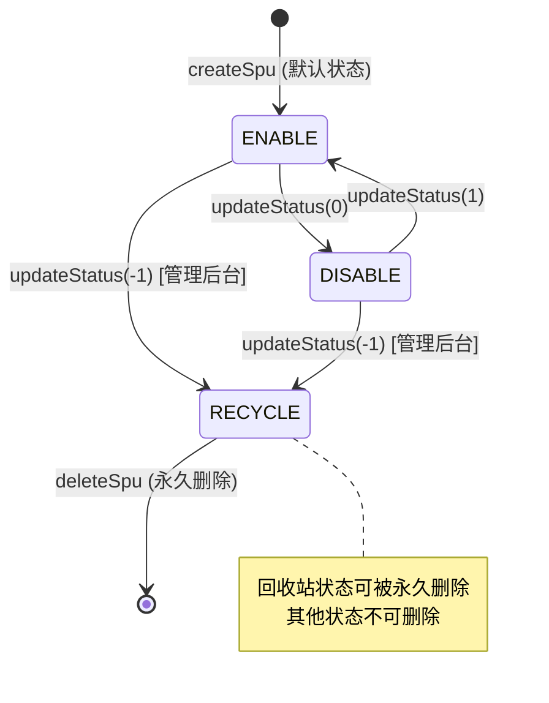
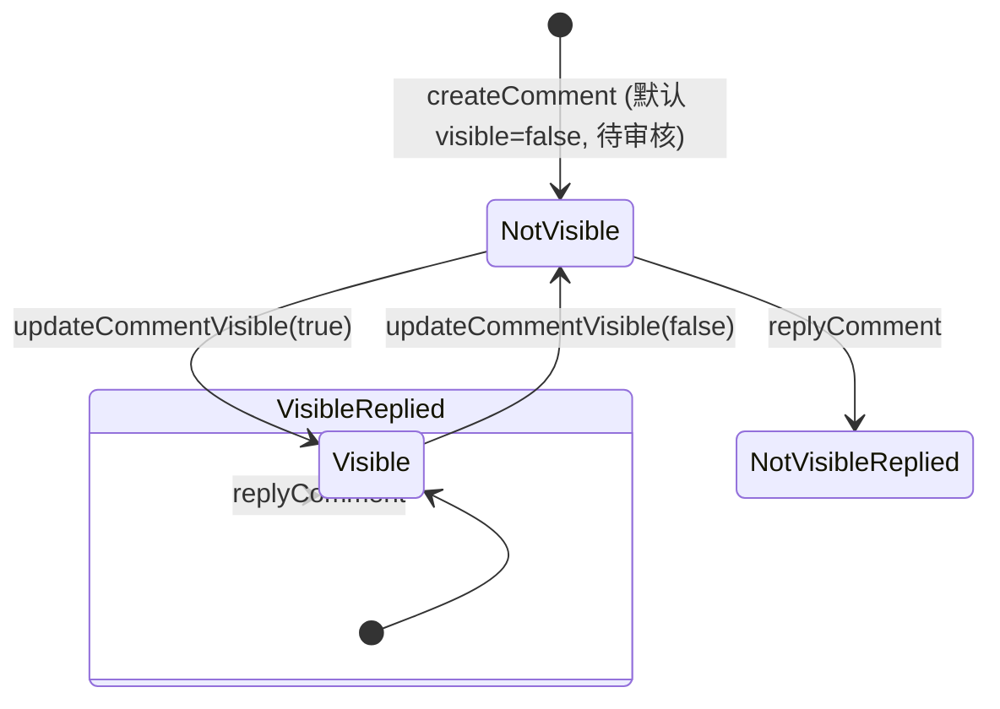

# 状态机：商城商品中心后端 (backend-package-yudao-module-product)

入口 ID：backend-package-yudao-module-product
证据：evidence/backend-package-yudao-module-product/{nodes,typecards}.json
覆盖：5 类核心状态机

---

## 1. SPU 销售状态机

### 1.1 状态定义

枚举 `ProductSpuStatusEnum`：

| 状态码 | 枚举名 | 中文 | 含义 |
|---|---|---|---|
| -1 | RECYCLE | 回收站 | 已删除的 SPU，可永久删除 |
| 0 | DISABLE | 下架 | 仓库中的 SPU，不可被用户看到 |
| 1 | ENABLE | 上架 | 销售中的 SPU，对用户可见可购买 |

辅助方法 `isEnable(Integer status)`：判断 status 是否为 ENABLE(1)。

### 1.2 状态转移图



### 1.3 状态转移约束

| 起点 | 终点 | 触发方法 | 校验 |
|---|---|---|---|
| (无) | ENABLE | `createSpu` | 分类层级≥2、品牌有效、SKU 校验通过 |
| ENABLE | DISABLE | `updateSpuStatus` | SPU 存在 |
| DISABLE | ENABLE | `updateSpuStatus` | SPU 存在 |
| ENABLE/DISABLE | RECYCLE | `updateSpuStatus` | SPU 存在 |
| RECYCLE | (删除) | `deleteSpu` | SPU 存在、状态==RECYCLE（`SPU_NOT_RECYCLE`） |
| ENABLE | (校验) | `validateSpuList` (RPC) | SPU 存在、status==ENABLE（`SPU_NOT_ENABLE`） |

### 1.4 错误码

- `SPU_NOT_EXISTS` (1-008-005-000)：商品 SPU 不存在
- `SPU_NOT_ENABLE` (1-008-005-003)：商品 SPU 不处于上架状态
- `SPU_NOT_RECYCLE` (1-008-005-004)：商品 SPU 不处于回收站状态

**source_nodes**：`enum:ProductSpuStatusEnum`、`method:createSpu`、`method:updateSpuStatus`、`method:deleteSpu`、`method:validateSpuList`

---

## 2. 分类层级状态机

### 2.1 层级定义

- Level 0：顶级分类（`parentId == PARENT_ID_NULL(0L)`）
- Level 1：一级分类（顶级分类的子）
- Level 2：二级分类（一级分类的子，SPU 可挂载）
- Level 3+：非法（系统约束：父分类不能是二级分类）

常量 `ProductCategoryDO.CATEGORY_LEVEL = 2`，代表 SPU 必须挂载到二级及以下。

### 2.2 层级判定

`ProductCategoryServiceImpl.getCategoryLevel(id)`：

```
level = 1
for i in 0..127:  // 防止脏数据死循环
    category = selectById(id)
    if category == null or category.parentId == PARENT_ID_NULL:
        break
    level++
    id = category.parentId
return level
```

### 2.3 层级约束规则

| 操作 | 校验 | 错误码 |
|---|---|---|
| createCategory(parentId) | parentId=0L 跳过；否则父分类存在且 parentId=0L | CATEGORY_PARENT_NOT_EXISTS、CATEGORY_PARENT_NOT_FIRST_LEVEL |
| updateCategory(parentId) | 同上 | 同上 |
| validateCategory(id) | 分类存在且 status=ENABLE | CATEGORY_NOT_EXISTS、CATEGORY_DISABLED |
| validateCategoryList(ids) | 同 validateCategory + 层级≥2 | SPU_SAVE_FAIL_CATEGORY_LEVEL_ERROR |
| SPU createSpu/updateSpu | 分类层级≥2 | SPU_SAVE_FAIL_CATEGORY_LEVEL_ERROR |
| deleteCategory | 分类存在、无子分类、无关联 SPU | CATEGORY_EXISTS_CHILDREN、CATEGORY_HAVE_BIND_SPU |

### 2.4 错误码

- `CATEGORY_NOT_EXISTS` (1-008-001-000)：商品分类不存在
- `CATEGORY_PARENT_NOT_EXISTS` (1-008-001-001)：父分类不存在
- `CATEGORY_PARENT_NOT_FIRST_LEVEL` (1-008-001-002)：父分类不能是二级分类
- `CATEGORY_EXISTS_CHILDREN` (1-008-001-003)：存在子分类，无法删除
- `CATEGORY_DISABLED` (1-008-001-004)：商品分类已禁用，无法使用
- `CATEGORY_HAVE_BIND_SPU` (1-008-001-005)：类别下存在商品，无法删除
- `SPU_SAVE_FAIL_CATEGORY_LEVEL_ERROR` (1-008-005-001)：商品分类不正确，原因：必须使用第二级的商品分类及以下

**source_nodes**：`class:ProductCategoryDO`、`class:ProductCategoryServiceImpl`、`method:validateCategoryList`、`method:getCategoryLevel`

---

## 3. 评价可见性状态机

### 3.1 状态定义

评价有 2 个独立的状态字段：

| 字段 | 类型 | 取值 | 含义 |
|---|---|---|---|
| visible | Boolean | true/false | 评价是否对用户可见（管理员控制） |
| replyStatus | Integer | 0/1 | 商家是否已回复（0=未回复、1=已回复） |

### 3.2 状态转移图



### 3.3 业务规则

- 评价创建时默认 `visible=false`（待审核）
- 管理员通过 `updateCommentVisible` 控制可见性
- 商家通过 `replyComment` 添加回复；`replyStatus` 自动置 1
- 同一订单项只能创建一次评价（`COMMENT_ORDER_EXISTS`）

### 3.4 错误码

- `COMMENT_NOT_EXISTS` (1-008-007-000)：商品评价不存在
- `COMMENT_ORDER_EXISTS` (1-008-007-001)：订单的商品评价已存在

**source_nodes**：`class:ProductCommentDO`、`method:createComment`、`method:updateCommentVisible`、`method:replyComment`

---

## 4. 通用状态机

### 4.1 状态定义

`CommonStatusEnum` 框架级通用状态：

| 状态码 | 枚举名 | 含义 |
|---|---|---|
| 0 | DISABLE | 禁用 |
| 1 | ENABLE | 启用 |

### 4.2 适用实体

- `ProductCategoryDO.status`
- `ProductBrandDO.status`
- `ProductPropertyDO.status`（如存在）

### 4.3 状态约束

- 禁用的分类不可被 SPU 引用（`CATEGORY_DISABLED`）
- 禁用的品牌不可被 SPU 引用（`BRAND_DISABLED`）
- 仅启用的分类可被 App 端列表查询（`selectListByStatus(ENABLE)`）

**source_nodes**：`interface:ProductCategoryService`、`method:validateCategory`、`method:validateCategoryList`

---

## 5. SKU 规格类型状态机

### 5.1 状态定义

`ProductSpuDO.specType`（Boolean）：

| 值 | 含义 |
|---|---|
| false | 单规格：SPU 关联唯一一个 SKU |
| true | 多规格：SPU 关联多个 SKU（properties 组合不同） |

### 5.2 校验规则

`ProductSkuServiceImpl.validateSkuList(skus, specType)`：

- 当 `specType = false` 时，校验 SKU 列表只能有 1 个
- 当 `specType = true` 时，校验 SKU 列表 ≥ 1
- 校验所有 SKU 的属性项数量一致（`SPU_ATTR_NUMBERS_MUST_BE_EQUALS`）
- 校验所有 SKU 的属性组合不重复（`SKU_PROPERTIES_DUPLICATED`）

### 5.3 错误码

- `SKU_PROPERTIES_DUPLICATED` (1-008-006-001)：商品 SKU 的属性组合存在重复
- `SPU_ATTR_NUMBERS_MUST_BE_EQUALS` (1-008-006-002)：一个 SPU 下的每个 SKU，其属性项必须一致
- `SPU_SKU_NOT_DUPLICATE` (1-008-006-003)：一个 SPU 下的每个 SKU，必须不重复

**source_nodes**：`class:ProductSpuDO`、`method:initSpuFromSkus`、`method:validateSkuList`

---

## 6. 状态机总结

| 实体 | 状态字段 | 状态机复杂度 | 转移触发点 |
|---|---|---|---|
| SPU | status (3态) | 中等 | createSpu / updateStatus / deleteSpu |
| 分类 | 隐式层级 | 简单 | getCategoryLevel 递归 |
| 评价 | visible + replyStatus | 双字段 | createComment / updateVisible / replyComment |
| 品牌/属性 | status (2态) | 简单 | validate 调用 |
| SKU | specType (2态) | 简单 | validateSkuList 校验 |

**source_nodes**：所有状态机的入口点（service 方法、controller 端点、rpc_method 节点）
