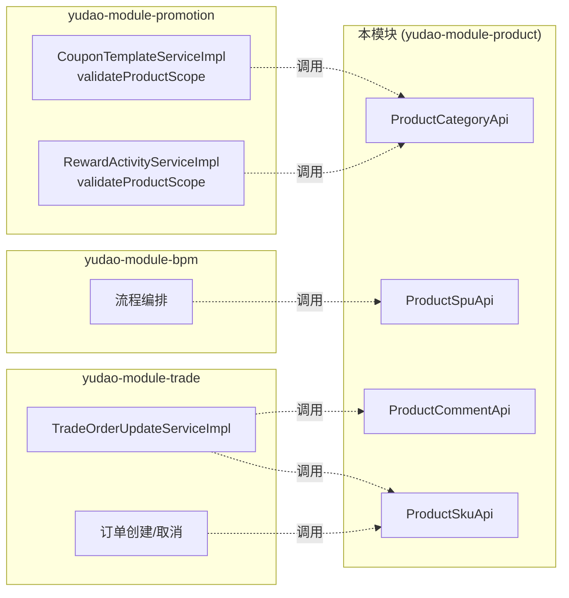
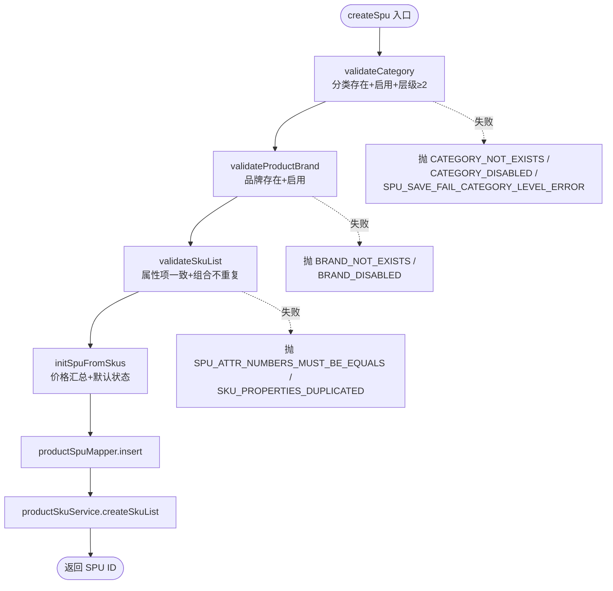
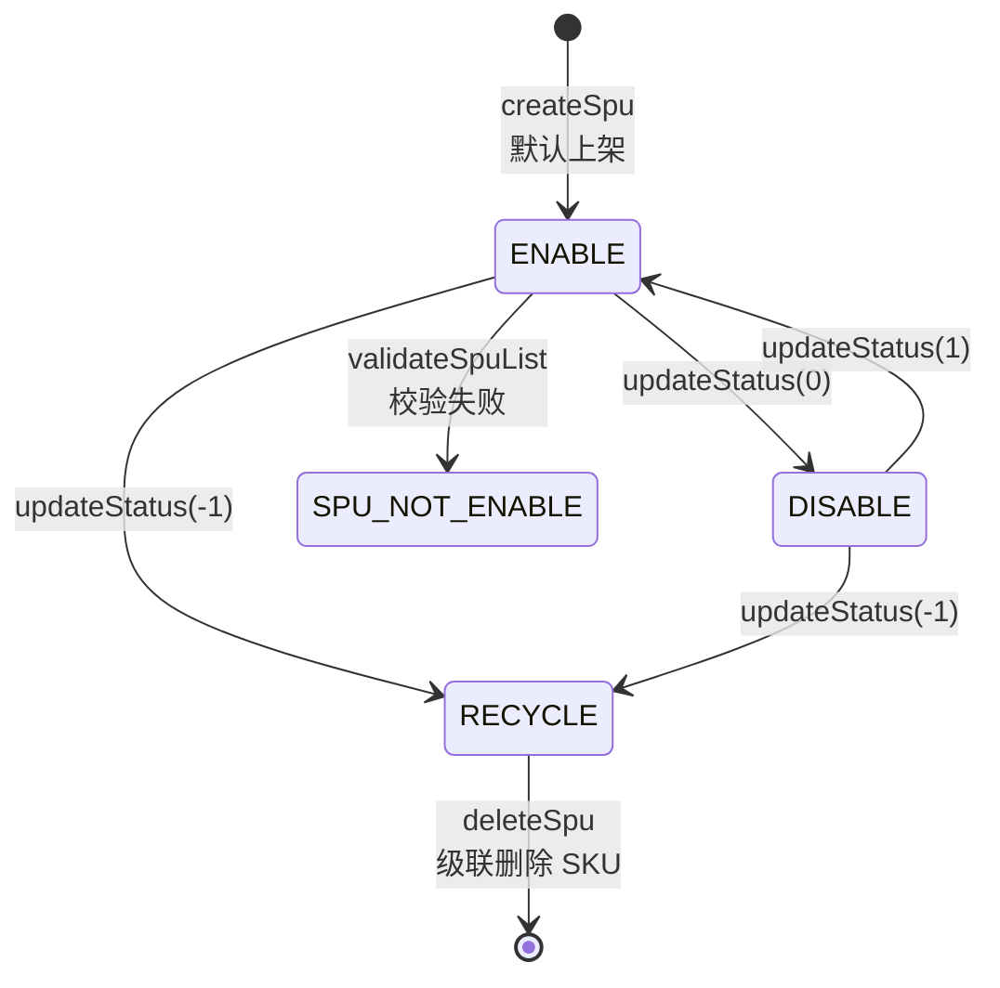
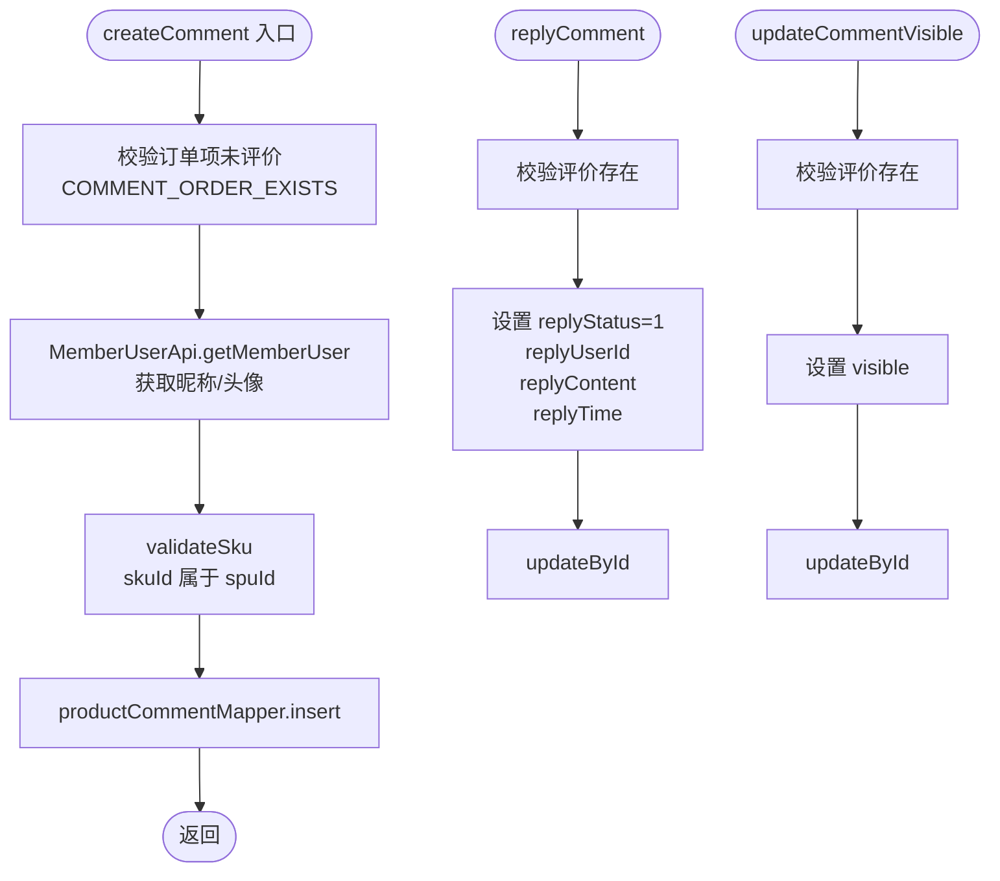

# 主业务流图：商城商品中心（后端）

入口：backend-package-yudao-module-product
证据：./entries/backend-package-yudao-module-product/business-flows.md

---

## 整体业务架构

```mermaid
graph TB
  subgraph "Admin 端 (管理后台)"
    BrandCtrl[ProductBrandController<br/>7 endpoints]
    CategoryCtrl[ProductCategoryController<br/>5 endpoints]
    SpuCtrl[ProductSpuController<br/>9 endpoints]
    PropertyCtrl[ProductPropertyController<br/>6 endpoints]
    PropertyValueCtrl[ProductPropertyValueController<br/>6 endpoints]
    CommentCtrl[ProductCommentController<br/>4 endpoints]
  end

  subgraph "App 端 (用户端)"
    AppCategoryCtrl[AppCategoryController<br/>3 endpoints]
    AppSpuCtrl[AppProductSpuController<br/>4 endpoints]
    AppCommentCtrl[AppProductCommentController<br/>2 endpoints]
    AppFavoriteCtrl[AppFavoriteController<br/>7 endpoints]
    AppHistoryCtrl[AppProductBrowseHistoryController<br/>4 endpoints]
  end

  subgraph "Service 层"
    BrandSvc[ProductBrandService]
    CategorySvc[ProductCategoryService]
    SpuSvc[ProductSpuService]
    SkuSvc[ProductSkuService]
    PropertySvc[ProductPropertyService]
    PropertyValueSvc[ProductPropertyValueService]
    CommentSvc[ProductCommentService]
    FavoriteSvc[ProductFavoriteService]
    HistorySvc[ProductBrowseHistoryService]
  end

  subgraph "Repository 层"
    BrandMapper[ProductBrandMapper]
    CategoryMapper[ProductCategoryMapper]
    SpuMapper[ProductSpuMapper]
    SkuMapper[ProductSkuMapper]
    PropertyMapper[ProductPropertyMapper]
    PropertyValueMapper[ProductPropertyValueMapper]
    CommentMapper[ProductCommentMapper]
    FavoriteMapper[ProductFavoriteMapper]
    HistoryMapper[ProductBrowseHistoryMapper]
  end

  subgraph "RPC 暴露"
    CategoryApi[ProductCategoryApi<br/>5 methods]
    SpuApi[ProductSpuApi<br/>4 methods]
    SkuApi[ProductSkuApi<br/>4 methods]
    CommentApi[ProductCommentApi<br/>1 method]
  end

  BrandCtrl --> BrandSvc --> BrandMapper
  CategoryCtrl --> CategorySvc --> CategoryMapper
  SpuCtrl --> SpuSvc --> SpuMapper
  SpuCtrl --> SkuSvc --> SkuMapper
  PropertyCtrl --> PropertySvc --> PropertyMapper
  PropertyValueCtrl --> PropertyValueSvc --> PropertyValueMapper
  CommentCtrl --> CommentSvc --> CommentMapper

  AppCategoryCtrl --> CategorySvc
  AppSpuCtrl --> SpuSvc
  AppCommentCtrl --> CommentSvc
  AppFavoriteCtrl --> FavoriteSvc --> FavoriteMapper
  AppHistoryCtrl --> HistorySvc --> HistoryMapper

  CategoryApi --> CategorySvc
  SpuApi --> SpuSvc
  SkuApi --> SkuSvc
  CommentApi --> CommentSvc

  SpuSvc -.->|@Lazy 循环依赖| CategorySvc
  CategorySvc -.->|@Lazy 循环依赖| SpuSvc
  SpuSvc --> BrandSvc
  SpuSvc --> SkuSvc
```

## 跨模块 RPC 消费关系



## 数据写入流（SPU 复合保存）



## SPU 状态机流转



## 评价处理流



## source_nodes 追溯

- 8 个 admin controller + 5 个 app controller 节点
- 9 个 service + 9 个 service_contract 节点
- 9 个 repository 节点
- 4 个 rpc_api + 4 个 rpc_contract 节点
- 54 个 endpoint 节点 + 20 个 rpc_method 节点
