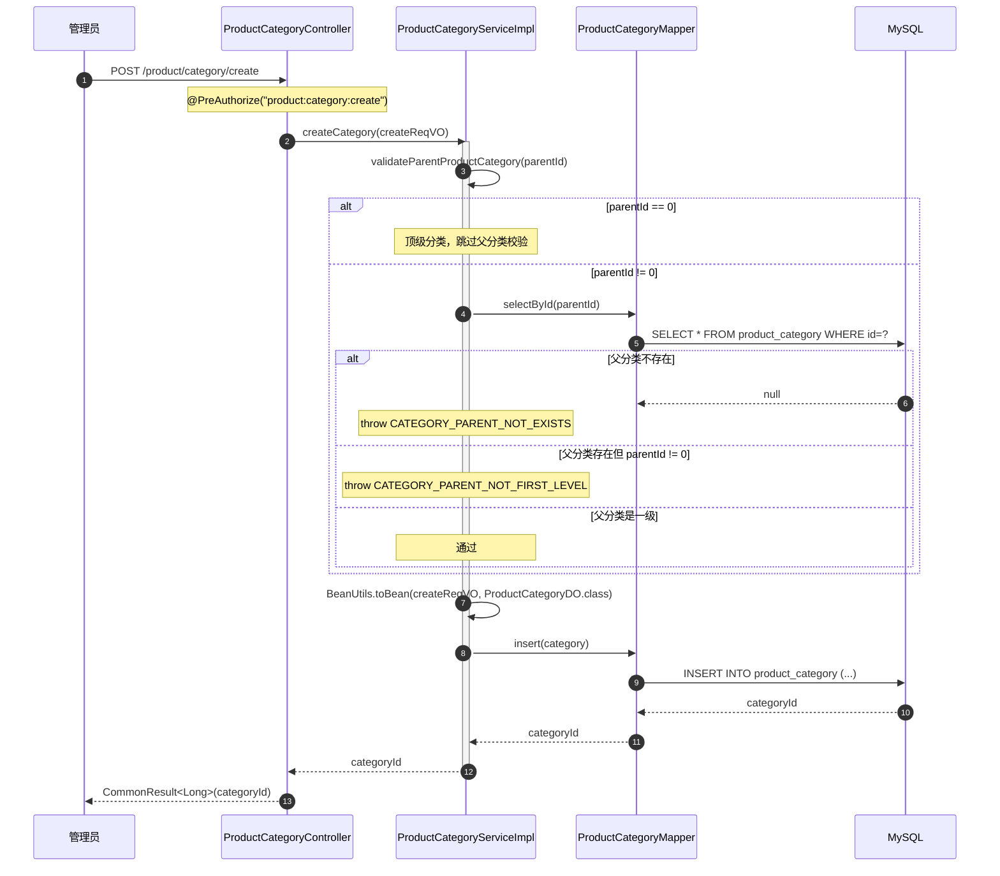
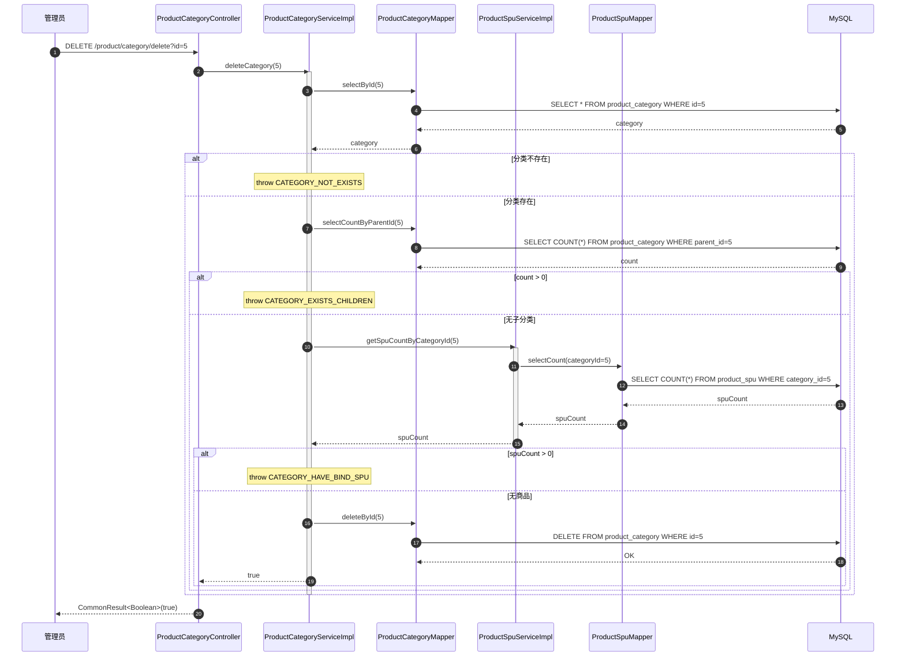
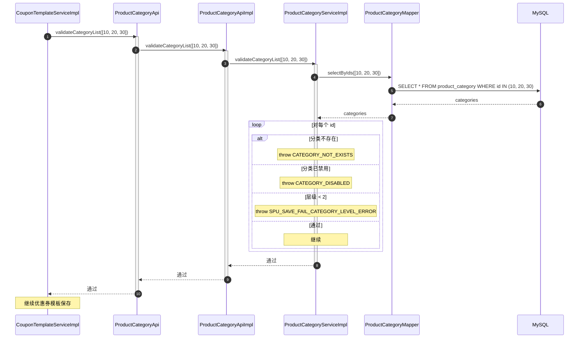
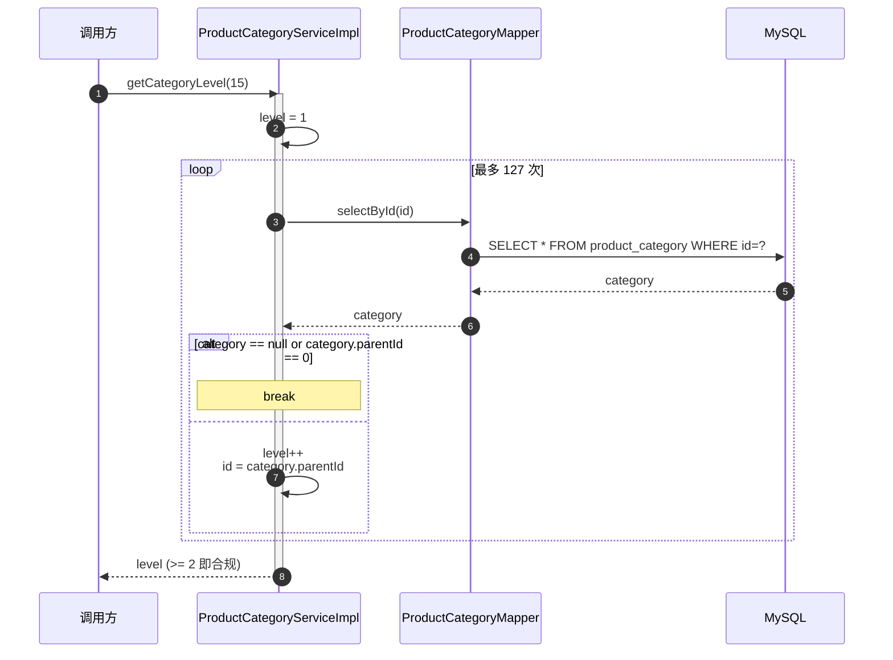

# 序列图：商品分类树 CRUD 与跨模块校验

入口：backend-package-yudao-module-product
来源：business-flows.md 流程 2

---

## 分类新增

## 分类删除（多重保护）

## 跨模块分类校验（营销活动范围）

## 层级递归计算

## source_nodes 追溯

- `method:createCategory` — 创建分类
- `method:updateCategory` — 更新分类
- `method:deleteCategory` — 删除分类
- `method:validateCategoryList` — 批量校验
- `method:validateParentProductCategory` — 父分类校验
- `method:getCategoryLevel` — 层级递归
- `interface:ProductCategoryApi`
- `class:ProductCategoryApiImpl`
- `class:ProductCategoryServiceImpl`
