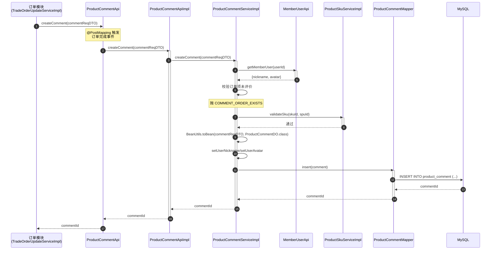
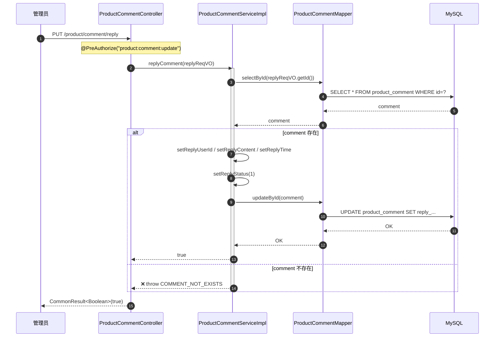
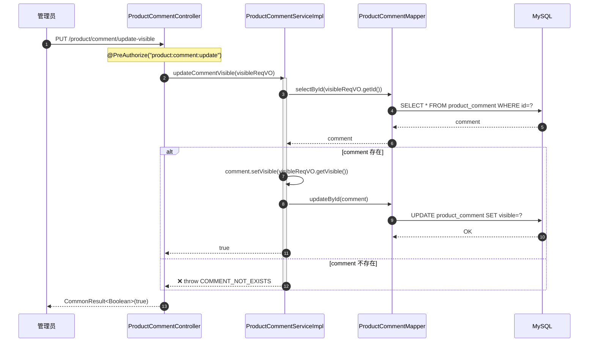
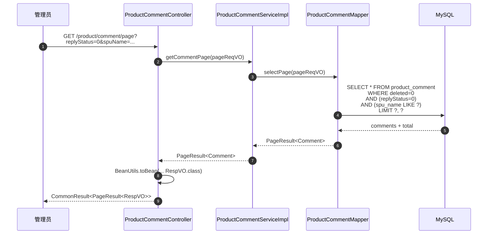

# 序列图：商品评价创建与回复

入口：backend-package-yudao-module-product
来源：business-flows.md 流程 5

---

## 用户创建评价（订单完成后自动调用）

## 商家回复评价

## 评价可见性切换

## 评价分页查询

## source_nodes 追溯

- `method:createComment` — 创建评价
- `method:replyComment` — 商家回复
- `method:updateCommentVisible` — 可见性切换
- `method:getCommentPage` — 分页查询
- `interface:ProductCommentApi`
- `class:ProductCommentApiImpl`
- `class:ProductCommentController`
