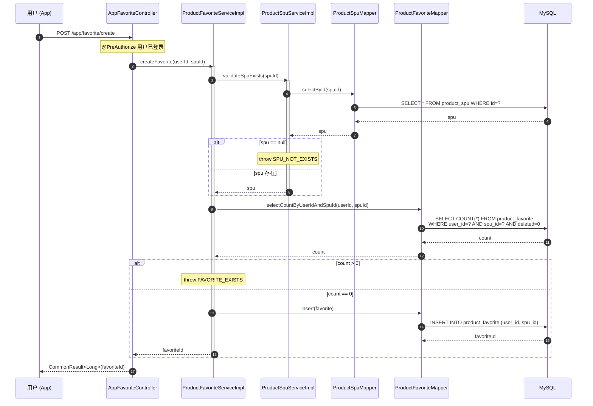
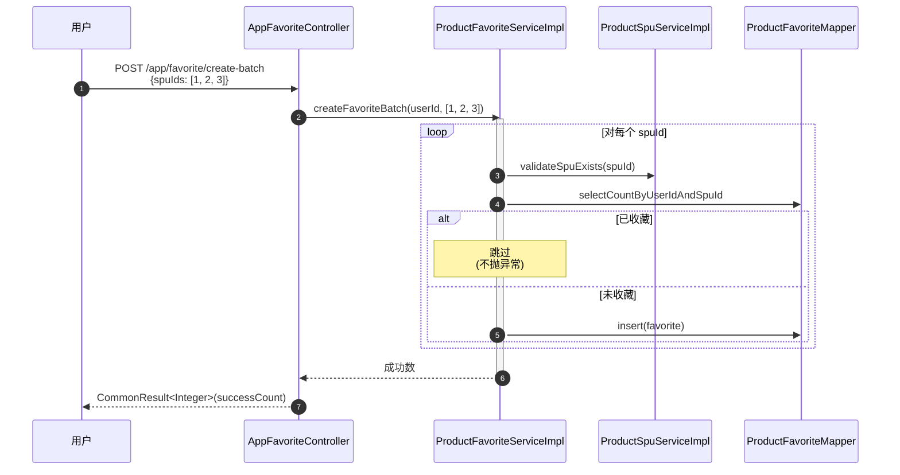
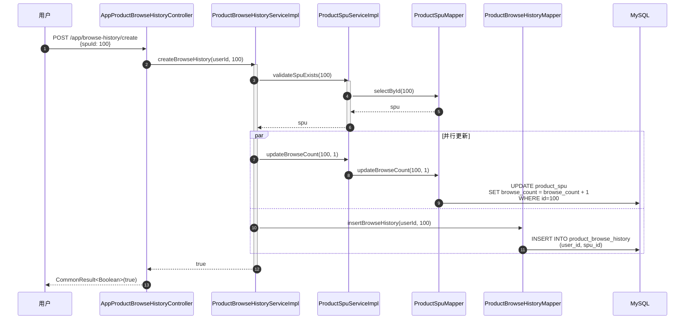
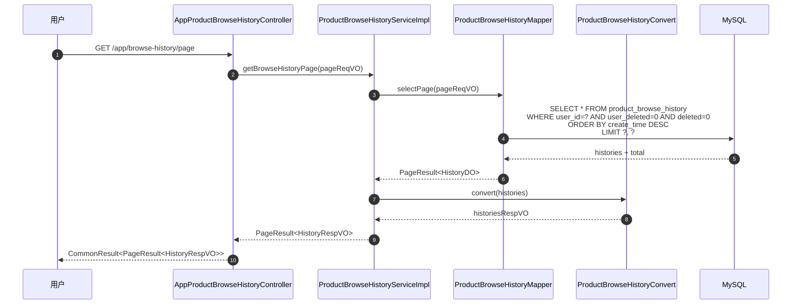

# 序列图：用户收藏与浏览历史

入口：backend-package-yudao-module-product
来源：business-flows.md 流程 7

---

## 用户收藏商品

## 批量收藏

## 浏览足迹记录（同时更新 SPU 浏览量）

## 浏览历史分页查询

## source_nodes 追溯

- `method:createFavorite` — 单条收藏
- `method:createFavoriteBatch` — 批量收藏
- `method:deleteFavorite` / `deleteFavoriteBatch` — 取消收藏
- `method:createBrowseHistory` — 浏览历史
- `method:updateBrowseCount` — 浏览量更新
- `method:getFavoritePage` / `getBrowseHistoryPage` — 分页查询
- `class:AppFavoriteController`
- `class:AppProductBrowseHistoryController`
