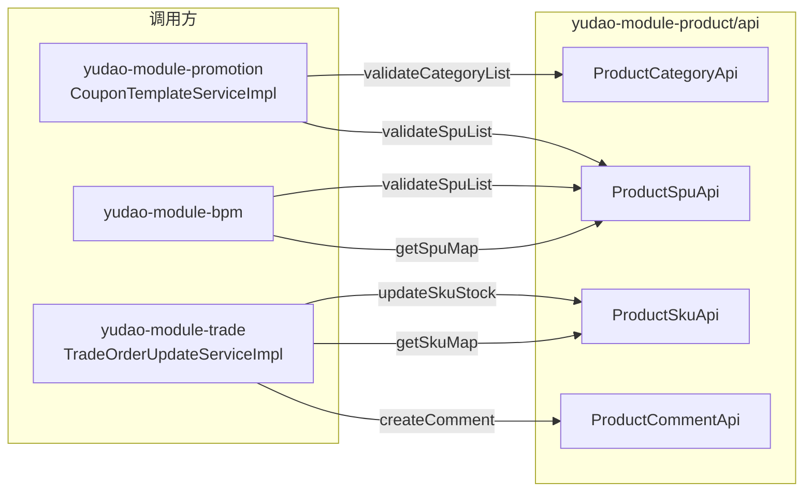
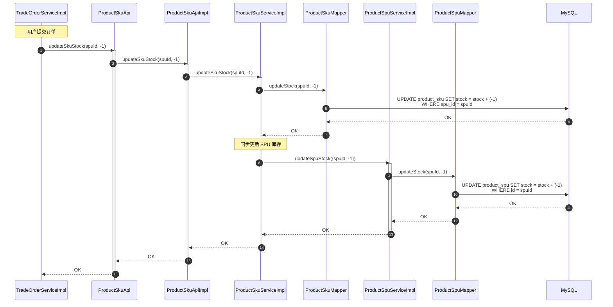
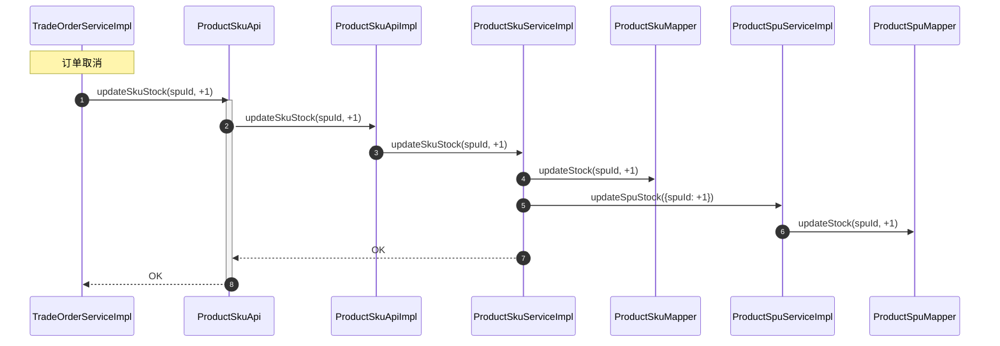
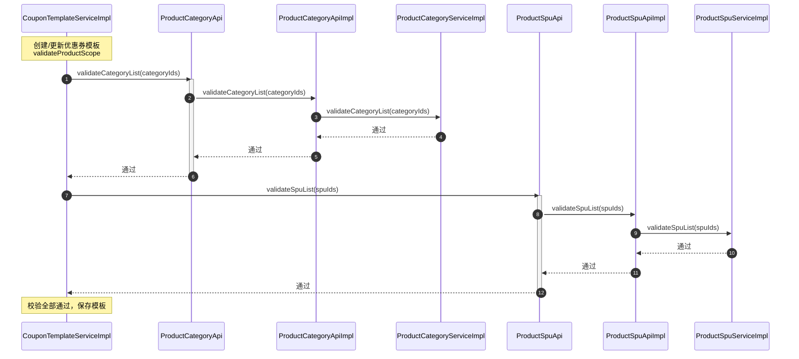
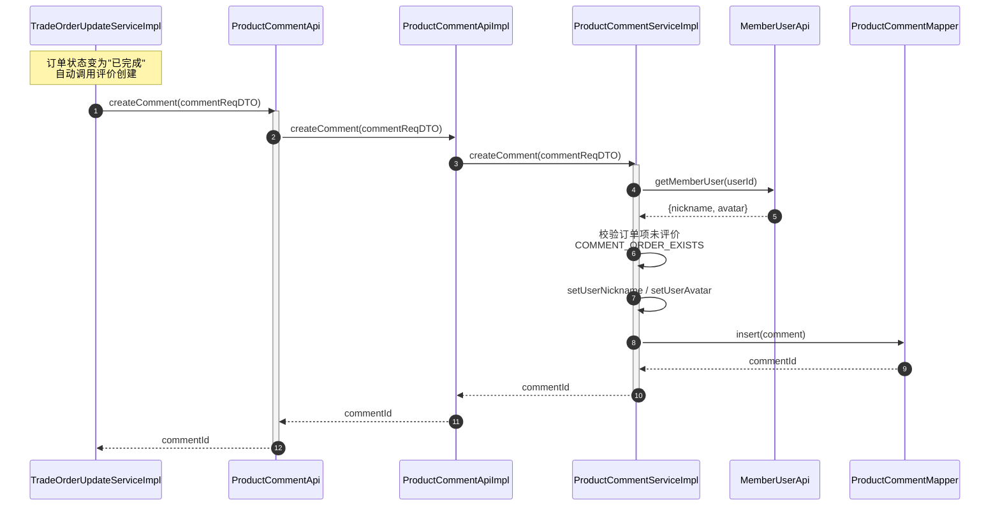

# 序列图：跨模块 RPC 调用

入口：backend-package-yudao-module-product
来源：business-flows.md 流程 9

---

## 整体 RPC 拓扑

## 订单创建时 SKU 库存更新

## 订单取消时 SKU 库存恢复

## 营销活动范围校验（分类 + SPU）

## 订单完成时评价创建

## source_nodes 追溯

- `interface:ProductCategoryApi` + `class:ProductCategoryApiImpl`
- `interface:ProductSpuApi` + `class:ProductSpuApiImpl`
- `interface:ProductSkuApi` + `class:ProductSkuApiImpl`
- `interface:ProductCommentApi` + `class:ProductCommentApiImpl`
- 跨模块消费方节点（已识别）：
  - `method:validateProductScope` (CouponTemplateServiceImpl)
  - `method:validateProductScope` (RewardActivityServiceImpl)
  - `method:createComment` (TradeOrderUpdateServiceImpl)
