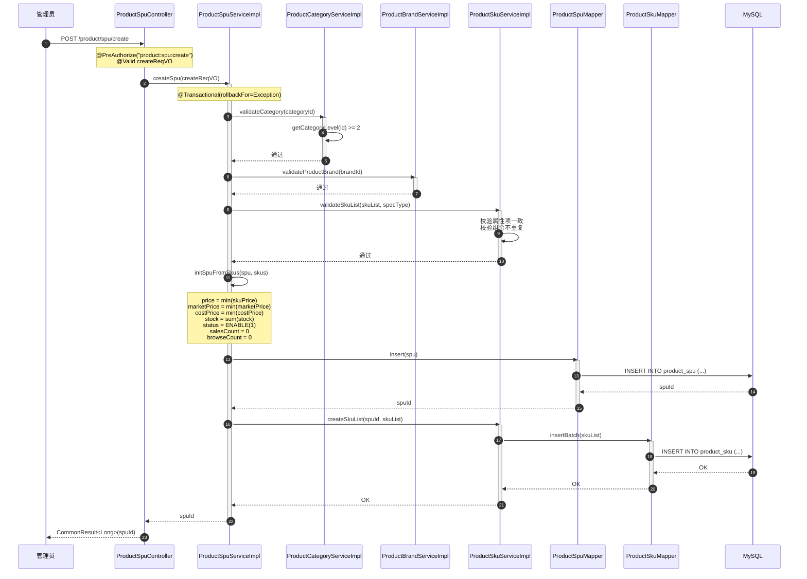
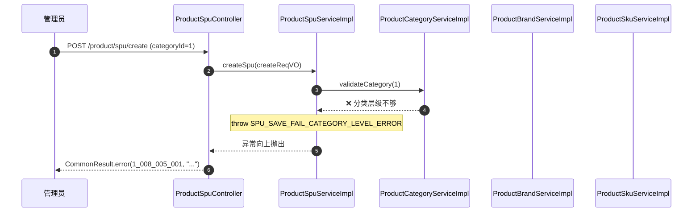
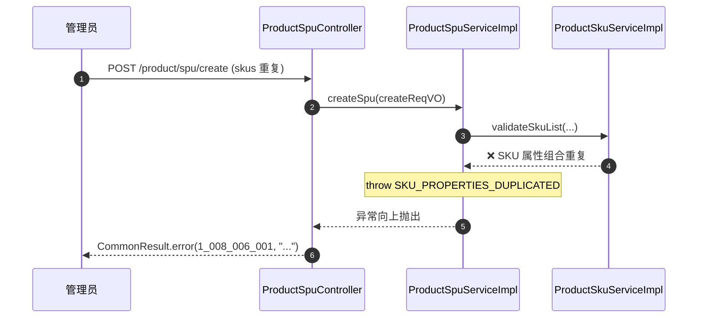

# 序列图：商品 SPU 复合表单保存

入口：backend-package-yudao-module-product
来源：business-flows.md 流程 4

---

## 主体流程

## 失败场景

## source_nodes 追溯

- `method:createSpu` — 事务入口
- `method:validateCategory` — 分类层级校验
- `method:initSpuFromSkus` — 价格汇总
- `method:validateSkuList` — SKU 校验
- `method:createSkuList` — SKU 批量插入
