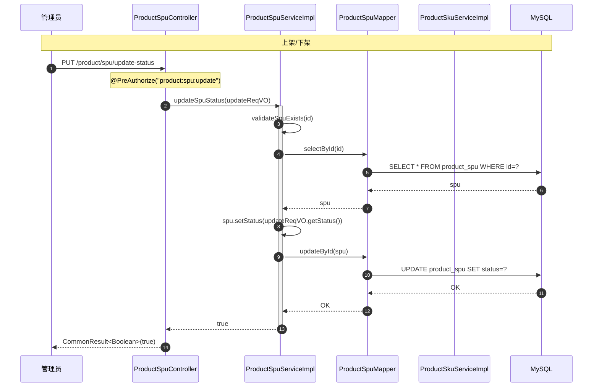
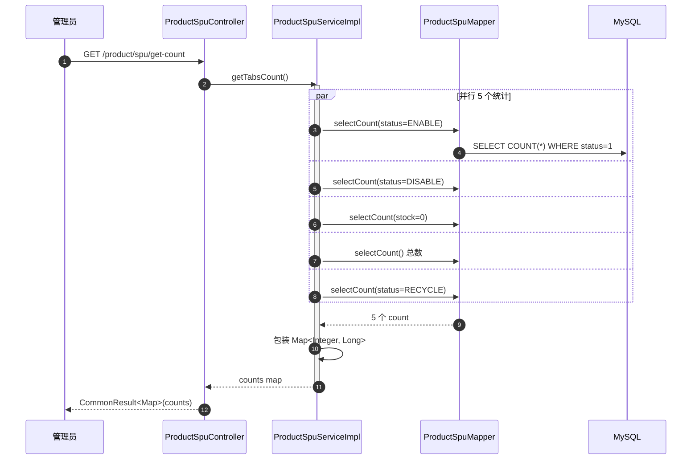
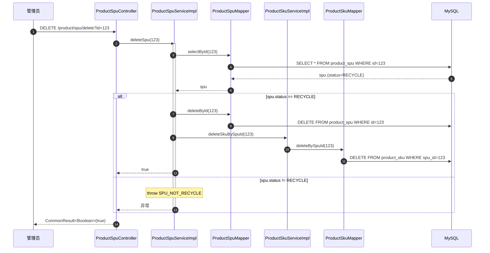
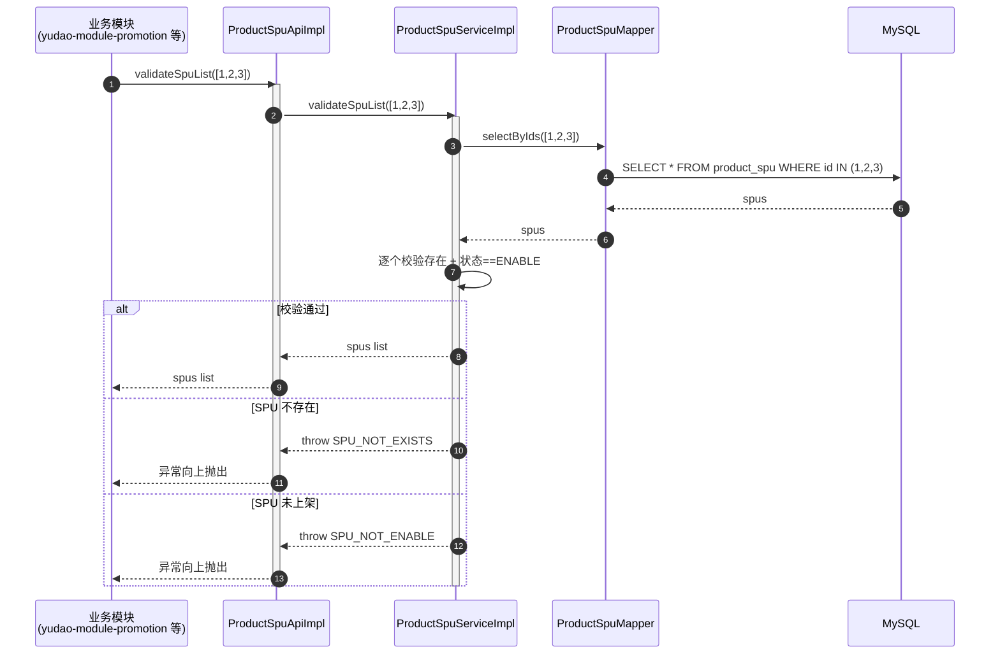

# 序列图：商品 SPU 状态流转

入口：backend-package-yudao-module-product
来源：business-flows.md 流程 3

---

## 主流程

## 状态 Tab 计数

## 删除流程（仅 RECYCLE 状态）

## 跨模块 SPU 校验

## source_nodes 追溯

- `method:updateSpuStatus`
- `method:deleteSpu`
- `method:getTabsCount`
- `method:validateSpuList`
- `method:deleteSkuBySpuId`
- `enum:ProductSpuStatusEnum`
