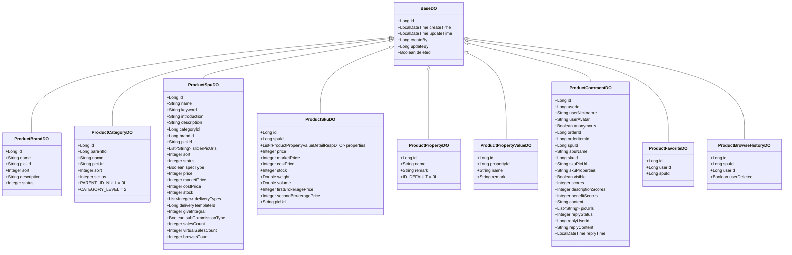
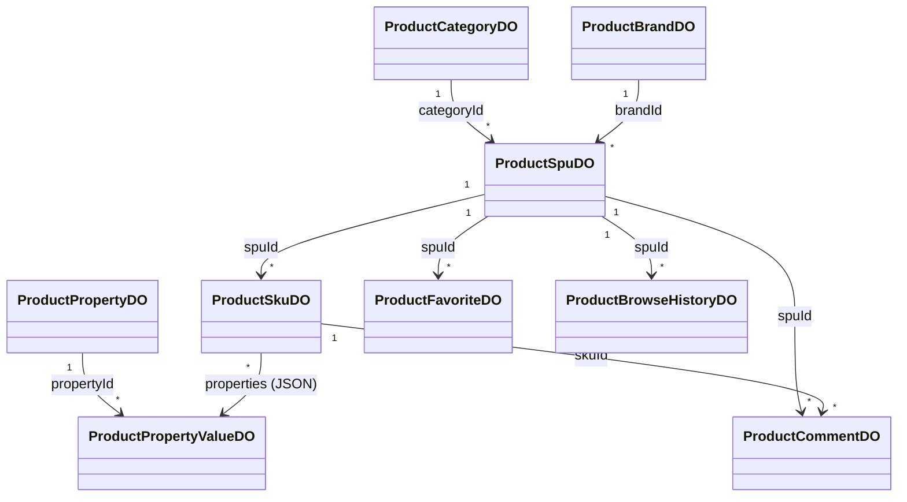
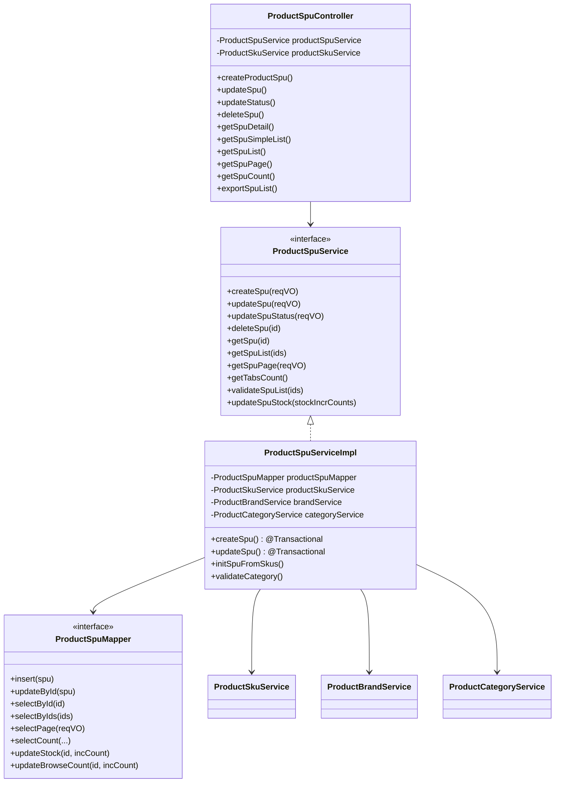
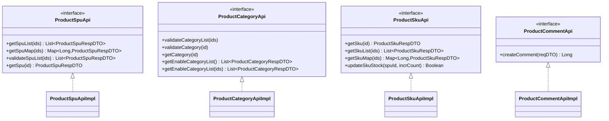

# 类体系：商城商品中心后端核心实体

入口：backend-package-yudao-module-product
证据：entries/backend-package-yudao-module-product/data-model.md

---

## 实体类继承关系

## 实体关联关系

## 控制器 / 服务 / 仓储分层

## Convert 类（MapStruct）

```mermaid
classDiagram
    class ProductSpuConvert {
        <<interface>>
        +INSTANCE
        +convert(spu, skus) ProductSpuRespVO
        +convertForSpuDetailRespListVO(spus, skus) List~ProductSpuRespVO~
        +convertList(spus) List~ProductSpuSimpleRespVO~
    }

    class ProductBrandConvert {
        <<interface>>
        +INSTANCE
        +convert(brand) ProductBrandRespVO
        +convertList(brands) List~ProductBrandRespVO~
        +convertList1(brands) List~ProductBrandSimpleRespVO~
    }

    class ProductCategoryConvert {
        <<interface>>
        +INSTANCE
        +convert(category) ProductCategoryRespVO
        +convertList(categories) List~ProductCategoryRespVO~
    }

    class ProductCommentConvert {
        <<interface>>
        +INSTANCE
        +convert(createReqVO) ProductCommentDO
        +convert(comments) List~ProductCommentRespVO~
    }

    class ProductFavoriteConvert {
        <<interface>>
        +INSTANCE
        +convert(reqVO) ProductFavoriteDO
        +convertList(favorites) List~AppFavoriteRespVO~
    }
```

## RPC 暴露类

## source_nodes 追溯

- 9 个 DO 实体（class）+ 9 个 service 契约（interface）+ 9 个 service 实现（class）
- 9 个 Mapper（interface）
- 4 个 RPC Api（interface）+ 4 个 RPC ApiImpl（class）
- 5 个 Convert（interface）
- 1 个 ProductWebConfiguration（class）
