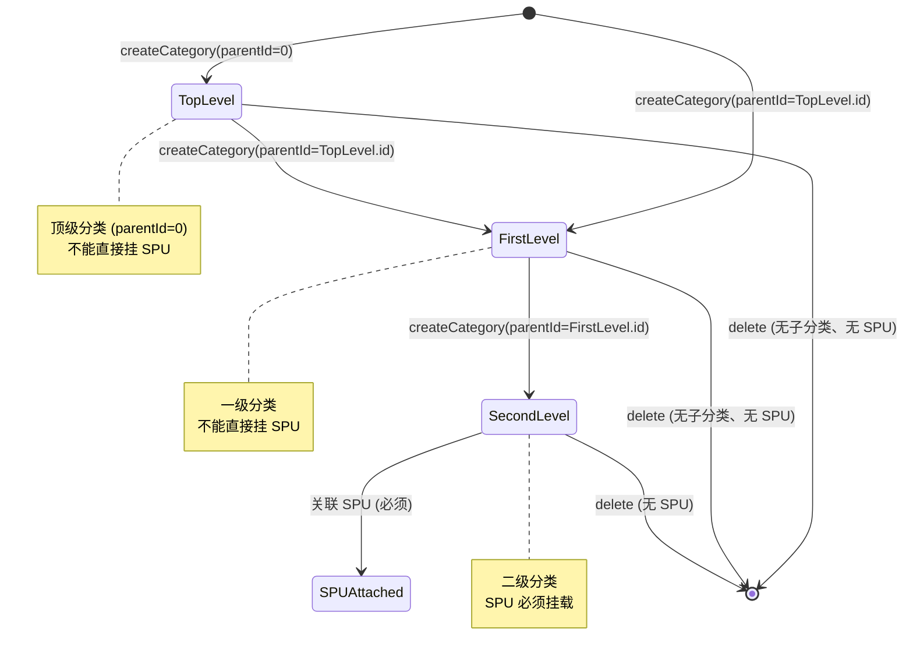
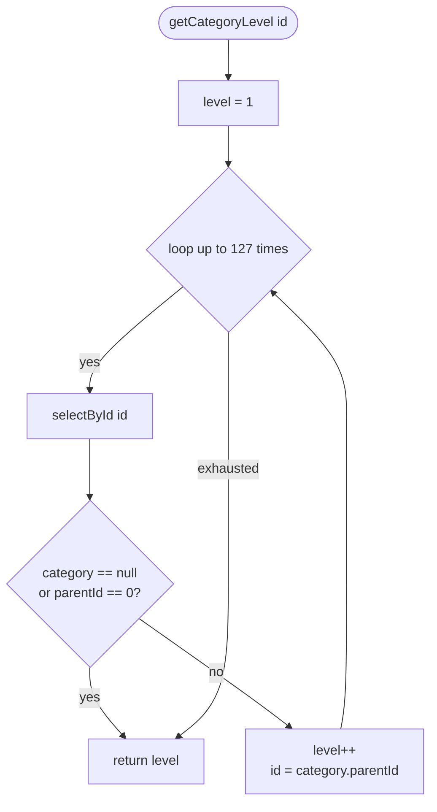
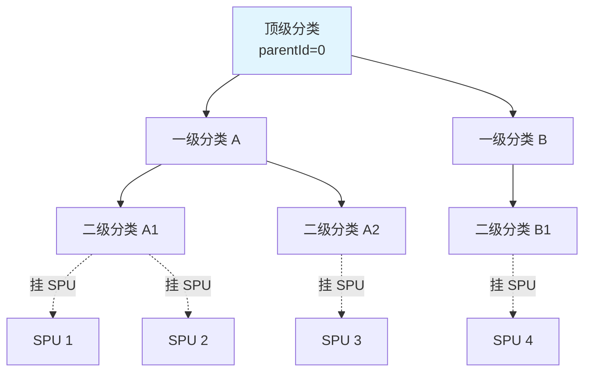

# 状态机：商品分类层级

入口：backend-package-yudao-module-product
证据：entries/backend-package-yudao-module-product/state-machines.md

---

## 分类层级状态机

## 层级判定算法

`getCategoryLevel(id)`：

## 层级约束规则

### 写入约束

| 操作 | 约束 | 错误码 |
|---|---|---|
| createCategory(parentId) | parentId=0L 直接通过 | - |
| createCategory(parentId) | 父分类存在 | CATEGORY_PARENT_NOT_EXISTS |
| createCategory(parentId) | 父分类为顶级（parentId=0） | CATEGORY_PARENT_NOT_FIRST_LEVEL |
| updateCategory(parentId) | 同上 | 同上 |
| SPU 关联分类 | 分类存在 | CATEGORY_NOT_EXISTS |
| SPU 关联分类 | 分类状态=ENABLE | CATEGORY_DISABLED |
| SPU 关联分类 | 层级 ≥ 2 | SPU_SAVE_FAIL_CATEGORY_LEVEL_ERROR |

### 删除约束

| 操作 | 约束 | 错误码 |
|---|---|---|
| deleteCategory | 分类存在 | CATEGORY_NOT_EXISTS |
| deleteCategory | 无子分类 | CATEGORY_EXISTS_CHILDREN |
| deleteCategory | 无关联 SPU | CATEGORY_HAVE_BIND_SPU |

## 树形结构示例

## 错误码

| 错误码 | 消息 | 触发场景 |
|---|---|---|
| 1-008-001-000 | 商品分类不存在 | validateCategory、validateCategoryList、getCategory |
| 1-008-001-001 | 父分类不存在 | validateParentProductCategory |
| 1-008-001-002 | 父分类不能是二级分类 | validateParentProductCategory |
| 1-008-001-003 | 存在子分类，无法删除 | deleteCategory |
| 1-008-001-004 | 商品分类({})已禁用，无法使用 | validateCategory、validateCategoryList |
| 1-008-001-005 | 类别下存在商品，无法删除 | deleteCategory |
| 1-008-005-001 | 商品分类不正确，原因：必须使用第二级的商品分类及以下 | validateCategory（SPU 创建/更新） |

## source_nodes 追溯

- `class:ProductCategoryDO` — 实体定义 + 常量 PARENT_ID_NULL、CATEGORY_LEVEL
- `method:createCategory` — 写入入口
- `method:updateCategory` — 更新入口
- `method:deleteCategory` — 删除入口
- `method:validateCategory` — 单条校验
- `method:validateCategoryList` — 批量校验（跨模块）
- `method:validateParentProductCategory` — 父分类校验
- `method:getCategoryLevel` — 层级递归
- `interface:ProductCategoryApi` — RPC 暴露
