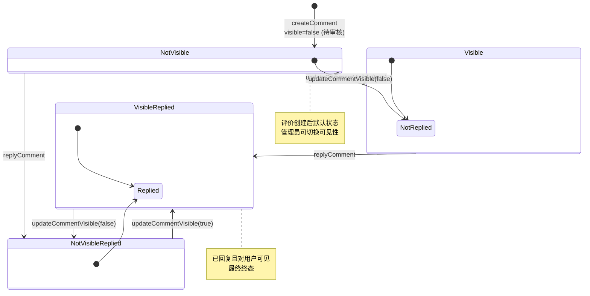

# 状态机：商品评价可见性

入口：backend-package-yudao-module-product
证据：entries/backend-package-yudao-module-product/state-machines.md

---

## 评价可见性状态机

评价有两个独立的状态字段：`visible`（可见性）和 `replyStatus`（回复状态）。

## 状态字段定义

| 字段 | 类型 | 取值 | 含义 |
|---|---|---|---|
| visible | Boolean | true | 评价对用户可见 |
| visible | Boolean | false | 评价对用户隐藏（待审核） |
| replyStatus | Integer | 0 | 商家未回复 |
| replyStatus | Integer | 1 | 商家已回复 |
| replyUserId | Long | - | 回复人 ID（replyStatus=1 时有效） |
| replyContent | String | - | 回复内容（replyStatus=1 时有效） |
| replyTime | LocalDateTime | - | 回复时间（replyStatus=1 时有效） |

## 状态转移约束

| 操作 | 入口端点 | 校验 |
|---|---|---|
| createComment | POST /product/comment/create | 订单项未评价（COMMENT_ORDER_EXISTS） |
| createComment | ProductCommentApi.createComment | SKU 属于 SPU（validateSku） |
| replyComment | PUT /product/comment/reply | 评价存在（COMMENT_NOT_EXISTS） |
| updateCommentVisible | PUT /product/comment/update-visible | 评价存在（COMMENT_NOT_EXISTS） |
| getCommentPage | GET /product/comment/page | 无（按 replyStatus 过滤） |

## 业务规则

- **创建评价**：默认 `visible=false`、`replyStatus=0`
- **可见性切换**：管理员通过 `updateCommentVisible` 任意切换 true/false
- **商家回复**：任意可见性状态下均可回复；`replyStatus` 置 1，记录 `replyUserId`/`replyContent`/`replyTime`
- **不可变字段**：评价创建后，`scores`/`descriptionScores`/`benefitScores`/`content` 等不可修改

## 错误码

- `COMMENT_NOT_EXISTS` (1-008-007-000)：商品评价不存在
- `COMMENT_ORDER_EXISTS` (1-008-007-001)：订单的商品评价已存在

## 评价列表展示矩阵

| visible | replyStatus | 列表展示 | 商家操作 |
|---|---|---|---|
| false (待审核) | 0 (未回复) | 隐藏 | 通过/回复 |
| false (待审核) | 1 (已回复) | 隐藏 | 通过/继续回复 |
| true (已通过) | 0 (未回复) | 展示（标"待回复"） | 回复 |
| true (已通过) | 1 (已回复) | 展示 | - |

## source_nodes 追溯

- `class:ProductCommentDO` — 实体定义（含 visible、replyStatus、replyUserId、replyContent、replyTime 字段）
- `method:createComment` — 创建评价
- `method:replyComment` — 商家回复
- `method:updateCommentVisible` — 可见性切换
- `method:getCommentPage` — 分页查询
- `interface:ProductCommentApi` — 跨模块暴露
