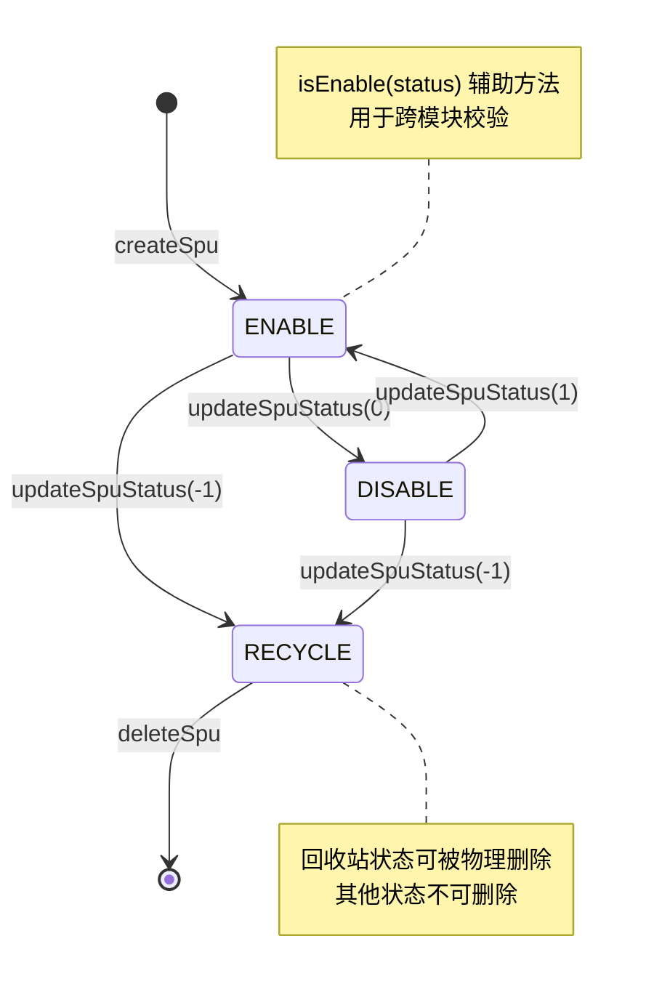

# 状态机：商品 SPU 销售状态

入口：backend-package-yudao-module-product
证据：entries/backend-package-yudao-module-product/state-machines.md

---

## SPU 销售状态机

## 状态字段定义

| 状态 | 枚举名 | 状态码 | 含义 |
|---|---|---|---|
| ENABLE | ProductSpuStatusEnum.ENABLE | 1 | 上架 |
| DISABLE | ProductSpuStatusEnum.DISABLE | 0 | 下架 |
| RECYCLE | ProductSpuStatusEnum.RECYCLE | -1 | 回收站 |

## 状态转移约束

| 起点 | 终点 | 触发方法 | 入口端点 | 校验 |
|---|---|---|---|---|
| (无) | ENABLE | `createSpu` | POST /product/spu/create | 分类层级、品牌、SKU |
| ENABLE | DISABLE | `updateSpuStatus(0)` | PUT /product/spu/update-status | SPU 存在 |
| DISABLE | ENABLE | `updateSpuStatus(1)` | PUT /product/spu/update-status | SPU 存在 |
| ENABLE | RECYCLE | `updateSpuStatus(-1)` | PUT /product/spu/update-status | SPU 存在 |
| DISABLE | RECYCLE | `updateSpuStatus(-1)` | PUT /product/spu/update-status | SPU 存在 |
| RECYCLE | (删除) | `deleteSpu(id)` | DELETE /product/spu/delete | 状态==RECYCLE（SPU_NOT_RECYCLE） |
| (跨模块) | (校验) | `validateSpuList` | ProductSpuApi | 存在 + ENABLE（SPU_NOT_EXISTS、SPU_NOT_ENABLE） |

## 业务规则

- **createSpu**：`initSpuFromSkus` 默认设置 `status = ENABLE(1)`
- **updateSpuStatus**：保留原 `sort` 字段，仅修改 `status`
- **deleteSpu**：必须为 RECYCLE 状态；级联删除所有 SKU
- **validateSpuList**：跨模块消费，仅校验 `status == ENABLE`

## 错误码

- `SPU_NOT_EXISTS` (1-008-005-000)：商品 SPU 不存在
- `SPU_NOT_ENABLE` (1-008-005-003)：商品 SPU【{}】不处于上架状态
- `SPU_NOT_RECYCLE` (1-008-005-004)：商品 SPU 不处于回收站状态

## source_nodes 追溯

- `enum:ProductSpuStatusEnum` — 枚举定义
- `method:createSpu` — 默认上架入口
- `method:updateSpuStatus` — 状态变更
- `method:deleteSpu` — 物理删除
- `method:validateSpuList` — 跨模块校验
- `method:isEnable` — 状态辅助判断
