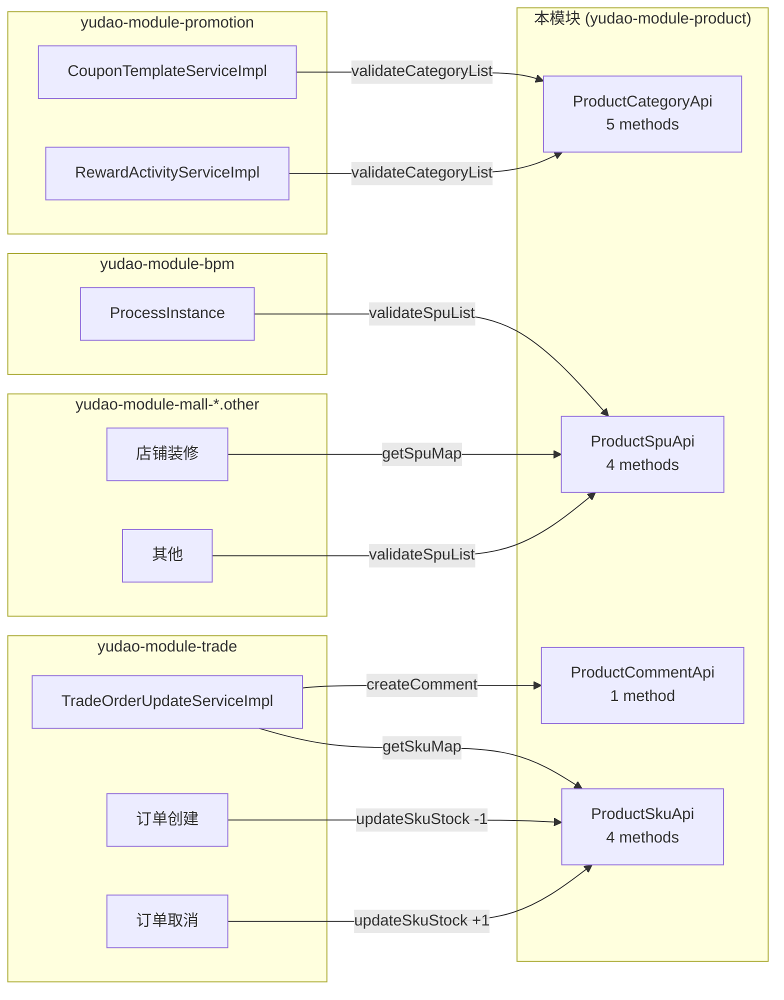

# 组件依赖图：商城商品中心后端

入口：backend-package-yudao-module-product
证据：entries/backend-package-yudao-module-product/architecture.md

---

## 整体组件拓扑

```mermaid
graph TB
  subgraph "外部调用方"
    Frontend[yudao-ui-admin-vue3<br/>src/views/mall/product]
    App[yudao-ui-admin-vue3<br/>App 端]
    TradeSvc[yudao-module-trade]
    PromoSvc[yudao-module-promotion]
    BpmSvc[yudao-module-bpm]
  end

  subgraph "yudao-module-product"
    subgraph "Controller 层"
      AdminCtrl[admin/*Controller<br/>8 个 + 53 endpoints]
      AppCtrl[app/*Controller<br/>5 个 + 12 endpoints]
    end

    subgraph "Service 层"
      BrandSvc[ProductBrandService]
      CategorySvc[ProductCategoryService]
      SpuSvc[ProductSpuService]
      SkuSvc[ProductSkuService]
      PropertySvc[ProductPropertyService]
      PropertyValueSvc[ProductPropertyValueService]
      CommentSvc[ProductCommentService]
      FavoriteSvc[ProductFavoriteService]
      HistorySvc[ProductBrowseHistoryService]
    end

    subgraph "API 层 (RPC 暴露)"
      CategoryApi[ProductCategoryApi]
      SpuApi[ProductSpuApi]
      SkuApi[ProductSkuApi]
      CommentApi[ProductCommentApi]
    end

    subgraph "Repository 层"
      BrandMapper[ProductBrandMapper]
      CategoryMapper[ProductCategoryMapper]
      SpuMapper[ProductSpuMapper]
      SkuMapper[ProductSkuMapper]
      PropertyMapper[ProductPropertyMapper]
      PropertyValueMapper[ProductPropertyValueMapper]
      CommentMapper[ProductCommentMapper]
      FavoriteMapper[ProductFavoriteMapper]
      HistoryMapper[ProductBrowseHistoryMapper]
    end

    subgraph "Entity 层"
      BrandDO[ProductBrandDO]
      CategoryDO[ProductCategoryDO]
      SpuDO[ProductSpuDO]
      SkuDO[ProductSkuDO]
      PropertyDO[ProductPropertyDO]
      PropertyValueDO[ProductPropertyValueDO]
      CommentDO[ProductCommentDO]
      FavoriteDO[ProductFavoriteDO]
      HistoryDO[ProductBrowseHistoryDO]
    end

    subgraph "Convert 层"
      BrandConvert[ProductBrandConvert]
      CategoryConvert[ProductCategoryConvert]
      SpuConvert[ProductSpuConvert]
      CommentConvert[ProductCommentConvert]
      FavoriteConvert[ProductFavoriteConvert]
    end

    subgraph "公共层"
      ErrorCode[ErrorCodeConstants]
      SpuStatusEnum[ProductSpuStatusEnum]
      DictType[DictTypeConstants]
      WebConfig[ProductWebConfiguration]
    end
  end

  subgraph "yudao-framework"
    CommonResult[CommonResult]
    PageResult[PageResult]
    BaseDO[BaseDO]
    TypeHandler[TypeHandler]
    Security[Spring Security]
  end

  subgraph "yudao-module-member"
    MemberApi[MemberUserApi]
  end

  Frontend -->|HTTP| AdminCtrl
  App -->|HTTP| AppCtrl

  TradeSvc -->|RPC| SkuApi
  TradeSvc -->|RPC| CommentApi
  PromoSvc -->|RPC| CategoryApi
  PromoSvc -->|RPC| SpuApi
  BpmSvc -->|RPC| SpuApi

  AdminCtrl --> BrandSvc
  AdminCtrl --> CategorySvc
  AdminCtrl --> SpuSvc
  AdminCtrl --> PropertySvc
  AdminCtrl --> PropertyValueSvc
  AdminCtrl --> CommentSvc
  AppCtrl --> CategorySvc
  AppCtrl --> SpuSvc
  AppCtrl --> CommentSvc
  AppCtrl --> FavoriteSvc
  AppCtrl --> HistorySvc

  CategoryApi --> CategorySvc
  SpuApi --> SpuSvc
  SkuApi --> SkuSvc
  CommentApi --> CommentSvc

  BrandSvc --> BrandMapper
  CategorySvc --> CategoryMapper
  SpuSvc --> SpuMapper
  SpuSvc --> SkuSvc
  SpuSvc --> BrandSvc
  SpuSvc -.->|@Lazy| CategorySvc
  CategorySvc -.->|@Lazy| SpuSvc
  SkuSvc --> SkuMapper
  PropertySvc --> PropertyMapper
  PropertyValueSvc --> PropertyValueMapper
  CommentSvc --> CommentMapper
  CommentSvc --> SkuSvc
  FavoriteSvc --> FavoriteMapper
  FavoriteSvc --> SpuSvc
  HistorySvc --> HistoryMapper
  HistorySvc --> SpuSvc

  BrandMapper --> BrandDO
  CategoryMapper --> CategoryDO
  SpuMapper --> SpuDO
  SkuMapper --> SkuDO
  PropertyMapper --> PropertyDO
  PropertyValueMapper --> PropertyValueDO
  CommentMapper --> CommentDO
  FavoriteMapper --> FavoriteDO
  HistoryMapper --> HistoryDO

  AdminCtrl --> BrandConvert
  AdminCtrl --> SpuConvert
  AdminCtrl --> CategoryConvert
  AppCtrl --> SpuConvert

  BrandDO --> BaseDO
  CategoryDO --> BaseDO
  SpuDO --> BaseDO
  SkuDO --> BaseDO
  PropertyDO --> BaseDO
  PropertyValueDO --> BaseDO
  CommentDO --> BaseDO
  FavoriteDO --> BaseDO
  HistoryDO --> BaseDO

  CommentSvc --> MemberApi
  FavoriteSvc --> MemberApi
  HistorySvc --> MemberApi

  AdminCtrl --> Security
  AppCtrl --> Security
  BrandDO -.->|表名| TypeHandler
  SpuDO -.->|JSON| TypeHandler
```

## 跨模块 RPC 暴露矩阵



## 循环依赖解耦

```mermaid
graph LR
  CategorySvc[ProductCategoryService]
  SpuSvc[ProductSpuService]
  SkuSvc[ProductSkuService]

  CategorySvc -.->|@Lazy 注入| SpuSvc
  SpuSvc -.->|@Lazy 注入| CategorySvc
  SpuSvc --> SkuSvc

  Note1[删除分类时检查 SPU 数量<br/>CategorySvc → SpuSvc]
  Note2[SPU 校验分类层级<br/>SpuSvc → CategorySvc]
  Note3[SPU 保存/删除 SKU<br/>SpuSvc → SkuSvc]
```

## source_nodes 追溯

- 8 个 admin Controller + 5 个 app Controller
- 9 个 Service 接口 + 9 个 Service 实现
- 9 个 Mapper 接口
- 4 个 RPC Api + 4 个 RPC ApiImpl
- 5 个 Convert 接口
- 9 个 DO 实体
- 3 个枚举
- 1 个 ErrorCodeConstants
- 1 个 ProductWebConfiguration
