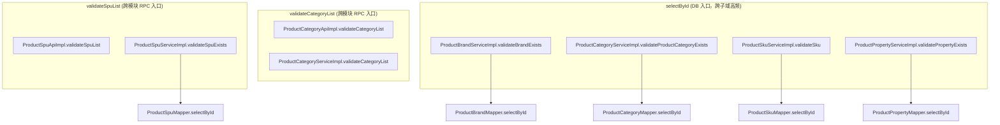
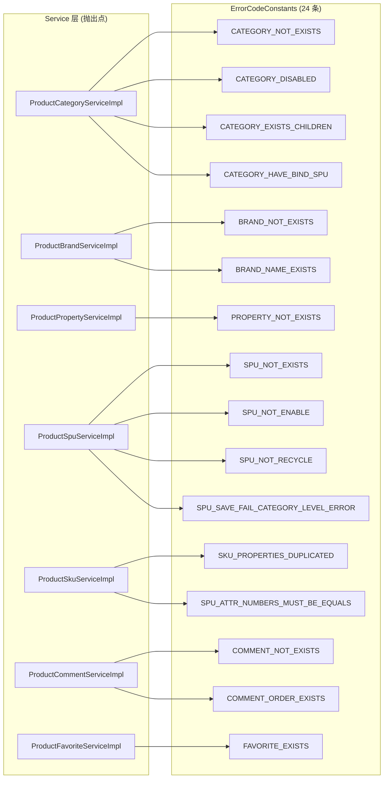

# 热点调用图：商城商品中心后端

入口：backend-package-yudao-module-product
证据：entries/backend-package-yudao-module-product/nodes.json（callees 关系）

---

## 高频被调用方法 Top 20

```mermaid
graph LR
  subgraph "高被调用方法（>= 4 个调用方）"
    M1[selectById<br/>MyBatis-Plus BaseMapper]
    M2[selectByIds<br/>MyBatis-Plus BaseMapper]
    M3[selectList<br/>MyBatis-Plus BaseMapper]
    M4[selectPage<br/>MyBatis-Plus BaseMapper]
    M5[selectCount<br/>MyBatis-Plus BaseMapper]
    M6[selectOne<br/>MyBatis-Plus BaseMapper]
    M7[insert<br/>MyBatis-Plus BaseMapper]
    M8[updateById<br/>MyBatis-Plus BaseMapper]
    M9[deleteById<br/>MyBatis-Plus BaseMapper]
    M10[convertMap<br/>CollectionUtils]
    M11[convertList<br/>CollectionUtils]
    M12[exception<br/>ServiceExceptionUtil]
    M13[BeanUtils.toBean<br/>对象拷贝]
    M14[isEnable<br/>ProductSpuStatusEnum]
    M15[validateSpuExists<br/>SPU 存在性校验]
    M16[validateCategory<br/>分类校验]
    M17[validateSpuList<br/>RPC 校验]
    M18[validateCategoryList<br/>RPC 校验]
    M19[getCategoryLevel<br/>递归层级]
    M20[CollUtil.isEmpty<br/>Hutool 集合工具]
  end

  M15 --> M1
  M16 --> M1
  M17 --> M2
  M17 --> M10
  M17 --> M12
  M18 --> M10
  M18 --> M12
  M19 --> M1
  M20 --> M2
```

## 跨页同名方法热点

多个 service 中存在同名方法，跨子域被调用：

## 错误抛出热点

`exception(ErrorCode)` 是最频繁的异常抛出点：

## source_nodes 追溯

- 169 个 service_method 节点
- 40 个 controller_method + 15 个 app_controller_method 节点
- 40 个 repository_method 节点
- 20 个 rpc_method 节点
- 19 个 convert_method 节点
- 1 个 framework 类（ProductWebConfiguration）
- 1 个 ErrorCodeConstants 接口（24 条 ErrorCode）
