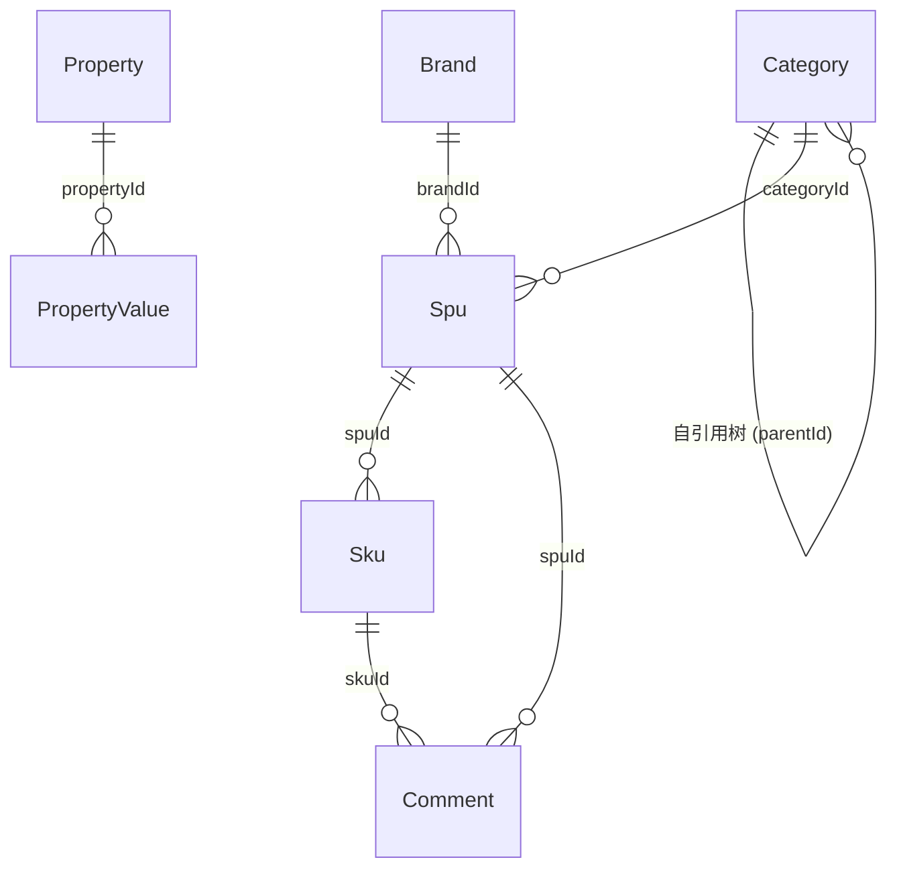

# 数据库视图汇总：商城商品中心前端

入口：frontend-mall-product（单入口）
证据：`./entries/frontend-mall-product/database.md`

---

## 9 个实体 ER 图

详见 [entries/frontend-mall-product/database.md](entries/frontend-mall-product/database.md)

## 关键约束

- SPU 状态字段索引（5 Tab 切换）
- 价格精度整数分（前端强制换算）
- SKU 名 = SPU 名（提交时回填）
- 评价 visible null → false 兜底
- 物理删除仅在回收站可见

## 写入/读取路径

详见 [entries/frontend-mall-product/database.md § "写入/读取路径"](entries/frontend-mall-product/database.md)
