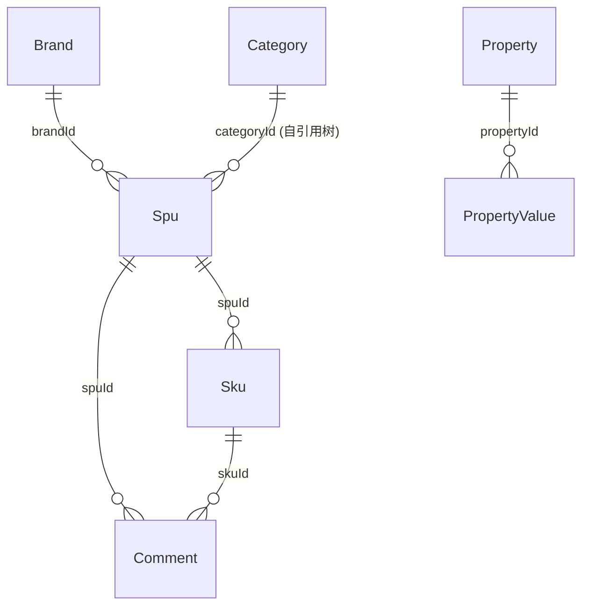

# 数据模型：商城商品中心前端 (frontend-mall-product)

入口 ID：frontend-mall-product
证据：evidence/frontend-mall-product/{nodes,typecards}.json
说明：以下为前端 TypeScript 层面的实体/类型/字段证据，**写入操作由后端 API 完成**，此处仅记录前端可见的形状与字段约束。

---

## 实体清单

### 1. BrandVO（品牌）
- **来源**：`@/api/mall/product/brand` → `ProductBrandApi.BrandVO`（被 `brand/index.vue`、`brand/BrandForm.vue` 引用）
- **字段**：
  - `id?: number`
  - `name: string`（必填，blur 校验）
  - `picUrl: string`（必填，UploadImg 限制 1 张）
  - `sort: number`（必填，el-input-number min=0）
  - `status: CommonStatusEnum`（必填，默认 ENABLE）
  - `description?: string`
- **公开方法（前端）**：`open(type, id?)`、`submitForm`、`resetForm`

### 2. CategoryVO（商品分类）
- **来源**：`@/api/mall/product/category` → `ProductCategoryApi.CategoryVO`
- **字段**：
  - `id?: number`
  - `parentId: number`（必填，0=顶级）
  - `name: string`（必填）
  - `picUrl: string`（必填，推荐 180x180）
  - `sort: number`（必填，min=0）
  - `status: CommonStatusEnum`（必填）
- **关系**：自引用树形（`parentId → id`），通过 `handleTree` 构树
- **公开方法**：`open(type, id?)`、`submitForm`、`handleTree` 包装

### 3. PropertyVO（属性项）
- **来源**：`@/api/mall/product/property` → `PropertyApi.PropertyVO`
- **字段**：
  - `id?: number`
  - `name: string`（必填）
  - `remark?: string`
- **公开方法**：`open(type, id?)`、`submitForm`

### 4. PropertyValueVO（属性值）
- **来源**：`PropertyApi.PropertyValueVO`
- **字段**：
  - `id?: number`
  - `propertyId: number`（必填，路由 params 注入）
  - `name: string`（必填）
  - `remark?: string`
- **关系**：`propertyId → PropertyVO.id`
- **公开方法**：`open(type, propertyId, id?)`、`submitForm`

### 5. CommentVO（商品评价）
- **来源**：`@/api/mall/product/comment` → `CommentApi.CommentVO`
- **字段**：
  - `id?: number`
  - `userId?: number`
  - `userNickname: string`（必填）
  - `userAvatar: string`（必填）
  - `spuId: number`（必填）
  - `skuId: number`（必填）
  - `descriptionScores: number`（必填，el-rate，默认 5）
  - `benefitScores: number`（必填，el-rate，默认 5）
  - `content: string`（必填）
  - `picUrls: string[]`（最多 9 张）
  - `replyContent?: string`（回复）
  - `visible: boolean`（是否展示，可由 Switch 切换）
  - `createTime: string`
  - `skuPicUrl?: string`（列表展示用）
  - `spuName?: string`（列表展示用）
  - `skuProperties?: { propertyId, propertyName, valueId, valueName }[]`（列表展示用）
- **公开方法**：`open(type, id?)`、`submitForm`、`handleVisibleChange`、`handleReply`

### 6. Spu（商品 SPU）
- **来源**：`@/api/mall/product/spu` → `ProductSpuApi.Spu`
- **字段**：
  - `id?: number`
  - `name: string`（必填，max 64 字）
  - `categoryId: number`（必填，级联）
  - `brandId: number`（必填，下拉）
  - `keyword: string`（必填）
  - `introduction: string`（必填，max 128 字）
  - `picUrl: string`（必填，封面图）
  - `sliderPicUrls: (string|{url: string})[]`（轮播图，前端选图时是对象，提交时转 URL 字符串）
  - `specType: boolean`（单/多规格）
  - `subCommissionType: boolean`（默认/单独分销）
  - `skus: Sku[]`（SKU 列表，详见 SPU 表单聚合）
  - `deliveryTypes: number[]`
  - `deliveryTemplateId?: number`
  - `description: string`（富文本）
  - `sort: number`
  - `giveIntegral: number`
  - `virtualSalesCount: number`
  - `marketPrice: number`（扩展行展示，分）
  - `costPrice: number`（扩展行展示，分）
  - `browseCount: number`（扩展行展示）
  - `price: number`（列表展示，分）
  - `salesCount: number`（列表展示）
  - `stock: number`（列表展示）
  - `status: number`（-1=回收站，0=下架，1=上架，详见 state-machines.md）

### 7. Sku（商品 SKU）
- **来源**：`ProductSpuApi.Sku`
- **字段**：
  - `id?: number`
  - `name: string`（提交时用 SPU.name 覆盖）
  - `price: number`（≥ 0.01 元，提交时元转分）
  - `marketPrice: number`（≥ 0.01 元）
  - `costPrice: number`（≥ 0.01 元）
  - `barCode: string`
  - `picUrl: string`
  - `stock: number`（≥ 1）
  - `weight: number`
  - `volume: number`
  - `firstBrokeragePrice: number`（一级分销佣金）
  - `secondBrokeragePrice: number`（二级分销佣金）
- **关系**：`spuId → Spu.id`（后端持有）

### 8. PropertyAndValues（多规格属性与值）
- **来源**：`@/views/mall/product/spu/components/index.ts` 导出
- **字段**：
  - `propertyId: number`
  - `propertyName: string`
  - `values: { id, name }[]`
- **公开方法（前端）**：`getPropertyList(spu: Spu): PropertyAndValues[]`

### 9. RuleConfig（SKU 校验规则）
- **来源**：`spu/components/index.ts`
- **字段**：
  - `name: 'stock' | 'price' | 'marketPrice' | 'costPrice'`
  - `rule: (arg: number) => boolean`
  - `message: string`

---

## 关系

---

## 值域

| 字段 | 合法值 | 来源 |
|---|---|---|
| CommonStatusEnum | ENABLE=0 / DISABLE=1 | @/utils/constants |
| ProductSpuStatusEnum | ENABLE=1, DISABLE=0, RECYCLE=-1 | @/utils/constants |
| TabType | 0=出售中, 1=仓库中, 2=已售罄, 3=警戒库存, 4=回收站 | spu/index.vue TabsData |
| 星级评分 | 0-5（el-rate） | CommentForm descriptionScores/benefitScores |
| 权限点前缀 | product:<resource>:<action> | v-hasPermi 指令 |

---

## 写入证据

| 操作 | API | 调用方 |
|---|---|---|
| 品牌新建/更新/删除 | createBrand / updateBrand / deleteBrand | brand/index.vue, brand/BrandForm.vue |
| 分类新建/更新/删除 | createCategory / updateCategory / deleteCategory | category/index.vue, category/CategoryForm.vue |
| 属性项新建/更新/删除 | createProperty / updateProperty / deleteProperty | property/index.vue, property/PropertyForm.vue |
| 属性值新建/更新/删除 | createPropertyValue / updatePropertyValue / deletePropertyValue | property/value/index.vue, property/value/ValueForm.vue |
| 评价新建/回复/显隐 | createComment / replyComment / updateCommentVisible | comment/index.vue, comment/CommentForm.vue, comment/ReplyForm.vue |
| SPU 新建/更新/状态/删除/导出 | createSpu / updateSpu / updateStatus / deleteSpu / exportSpu | spu/index.vue, spu/form/index.vue |
| SKU 编辑 | 嵌套在 updateSpu | spu/form/SkuForm.vue, spu/form/SkuList.vue |

## 未生效状态

- **未发现前端直接编辑 SKU 单行的 API**：SKU 的增删改均嵌套在 `updateSpu` 整体提交中，前端无独立 `updateSku` / `deleteSku` 调用。
- **未发现前端直接编辑 SPU 部分字段的 API**：除 `updateStatus` 外，所有 SPU 字段更新都通过整体 `updateSpu`。
- **未发现前端 SKU 价格直接"分"存"分"读**：所有 SKU 价格在前端均经过"分↔元"换算（fenToYuan / formatToFraction / convertToInteger）。
- **未发现 SKU 单独的删除/新建 API**：通过 `SkuList` 组件的 generateTableData + 整体 createSpu/updateSpu 完成。
