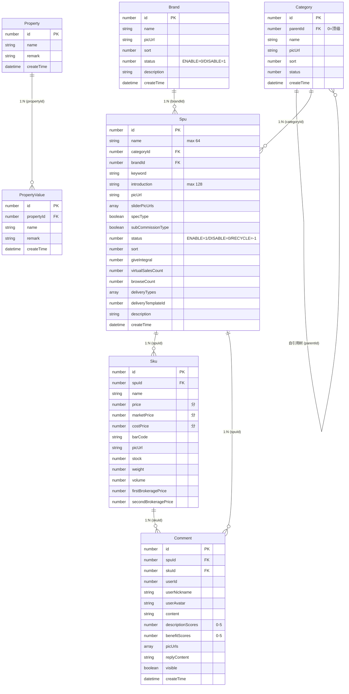

# 数据库视图：商城商品中心前端 (frontend-mall-product)

入口 ID：frontend-mall-product
说明：前端不直接持有数据库访问，所有数据通过 HTTP API 访问后端 yudao-module-product 模块（MySQL）。本文件仅记录前端可见的实体与字段，**用于理解后端持久化的形状**。

证据：evidence/frontend-mall-product/{nodes,typecards}.json + 业务理解

---

## 实体关系图

---

## 表/索引约束

> 以下为后端预期设计，前端无直接证据但通过 `updateStatus` / `deleteSpu` 等行为推测：

| 约束 | 类型 | 依据 |
|---|---|---|
| Brand.name | UNIQUE 可能 | 后端未明示，前端按 name 搜索 |
| Category.parentId | FK -> Category.id | 自引用树 |
| Spu.brandId | FK -> Brand.id | 列表/表单均按外键选择 |
| Spu.categoryId | FK -> Category.id | 级联选择 |
| Sku.spuId | FK -> Spu.id | 级联删除 |
| PropertyValue.propertyId | FK -> Property.id | 路由参数 + 外键 |
| Comment.spuId | FK -> Spu.id | 评价绑定商品 |
| Comment.skuId | FK -> Sku.id | 评价绑定规格 |
| SPU 状态过滤 | 索引 status | TabsData 5 Tab 切换 |
| 价格精度 | 整数分 | 前端 convertToInteger 强制 |

---

## 写入/读取路径

| 表 | 写入操作 | 读取操作 |
|---|---|---|
| Brand | createBrand, updateBrand, deleteBrand | getBrandParam (page), getBrand (by id) |
| Category | createCategory, updateCategory, deleteCategory | getCategoryList (filter by parentId, tree), getCategory (by id) |
| Property | createProperty, updateProperty, deleteProperty | getPropertyPage, getProperty (by id), getSimpleBrandList |
| PropertyValue | createPropertyValue, updatePropertyValue, deletePropertyValue | getPropertyValuePage, getPropertyValue (by id) |
| Spu | createSpu, updateSpu, updateStatus, deleteSpu | getSpuPage (tabType, name, categoryId, createTime), getSpu (by id), getTabsCount, exportSpu |
| Sku | 嵌套在 createSpu/updateSpu | 嵌套在 getSpu |
| Comment | createComment, replyComment, updateCommentVisible | getCommentPage, getComment (by id) |

---

## 数据完整性约束

- **SKU 名称回填**：前端在 submitForm 中用 SPU.name 覆盖所有 SKU.name，保证 SKU 名 = SPU 名（业务规则）
- **价格单位**：前端强制元↔分转换（`convertToInteger`、`formatToFraction`、`floatToFixed2`、`fenToYuan`），保证后端存储为整数分
- **可见性兜底**：`getList` 中 `if (!item.visible) item.visible = false`，避免 null 触发 Switch 误变更
- **删除二次确认**：所有删除类操作都需 `message.delConfirm()` 二次确认
- **回收站隔离**：SPU 物理删除按钮仅在 `tabType === 4` 显示；其他状态只能移到回收站

---

## 缓存/前端状态

| 缓存项 | 来源 | 失效时机 |
|---|---|---|
| 品牌列表缓存 | 无（每次 getList 都调 API） | 无 |
| 分类树缓存 | 无（每次 getList + form 打开都调 API） | 无 |
| SPU 表单数据 | formData (ref) | 路由切换 / close() |
| Tab 计数 | tabsData (ref) | handleStatusChange/02Change/handleDelete 后 refresh |
| 路由 query.categoryId | 分类列表"查看商品"跳转 | 重新进入路由 |
| 路由 params.propertyId | 属性列表"属性值"跳转 | 重新进入路由 |

**无前端持久化缓存**（无 Pinia / Vuex store 引用此入口的实体数据）。
