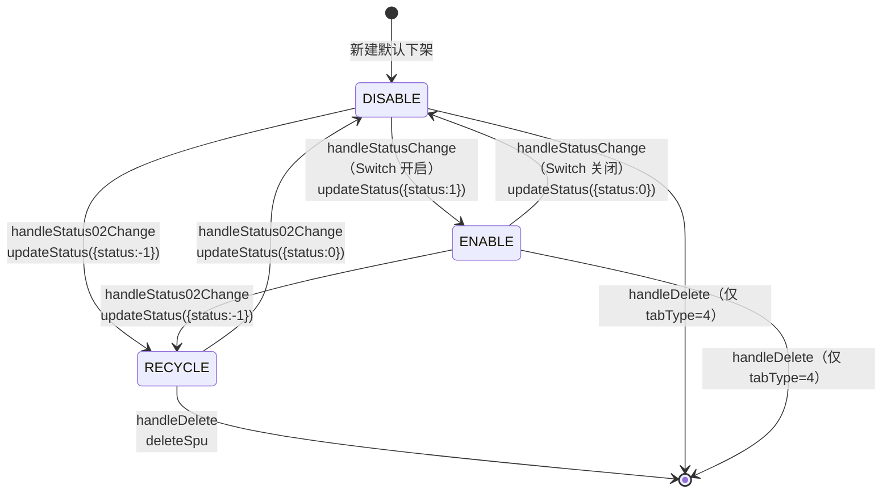
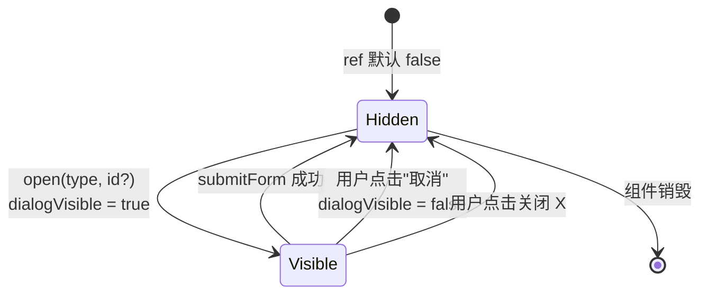
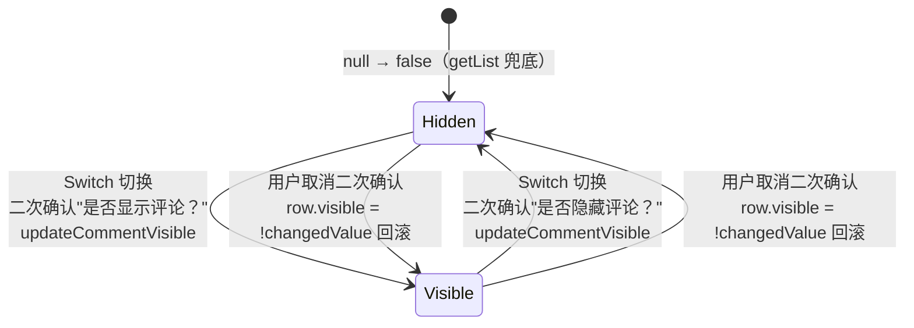
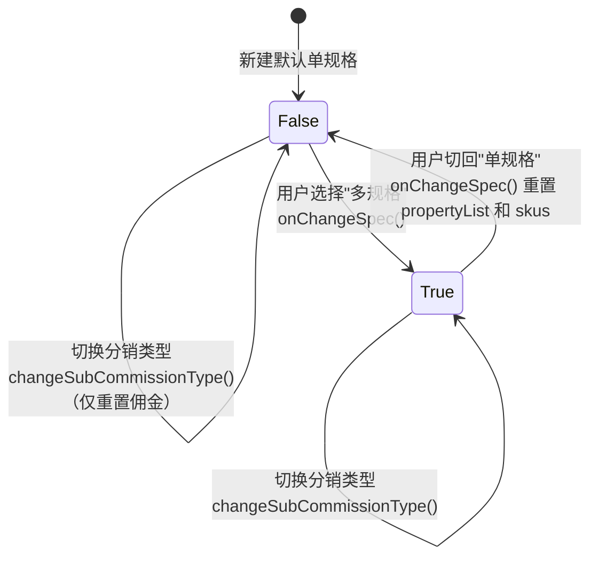
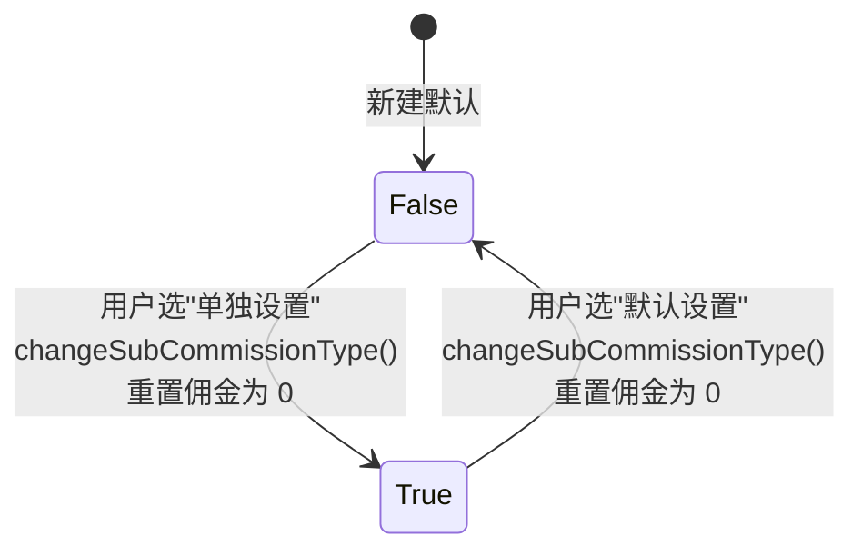
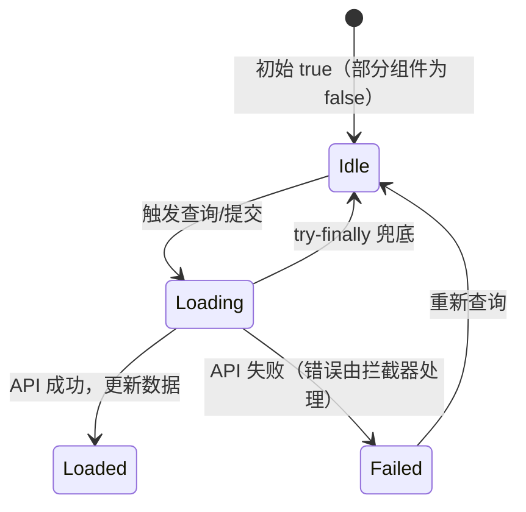

# 状态机：商城商品中心 (frontend-mall-product)

入口 ID：frontend-mall-product
证据：evidence/frontend-mall-product/{nodes,typecards}.json
说明：以下状态机仅描述前端可见的状态字段与流转，**实际持久化由后端 yudao-module-product 负责**。

---

## 1. SPU 销售状态机

**字段**：`Spu.status`（ProductSpuStatusEnum）
**状态值**：
- `ENABLE = 1`（上架/出售中）
- `DISABLE = 0`（下架/仓库中）
- `RECYCLE = -1`（回收站）

**前端 Tab 分组**：
- Tab 0（出售中）：status = 1 且 stock > 0
- Tab 1（仓库中）：status = 0
- Tab 2（已售罄）：status = 1 且 stock = 0
- Tab 3（警戒库存）：独立规则（后端计算）
- Tab 4（回收站）：status = -1

**状态流转图**：

**前端约束**：
- 列表行 Switch 仅在 `status >= 0` 时显示；`status < 0` 显示"回收站" tag
- 回收/恢复操作按钮在非回收站 Tab 显示"回收"，在回收站 Tab 显示"删除+恢复"
- `handleStatusChange` 异常时回滚 `row.status` 到原值（DISABLE ↔ ENABLE 翻转）
- 二次确认文案根据 newStatus 动态生成（"加入到回收站" / "恢复到仓库" / "上架" / "下架"）

**source_nodes**：`component:766a92ffa67135de01a5219da9b57bf5`（spu/index.vue）、`function:983b518f40fda455789509dcb62ad231`（handleStatusChange、handleStatus02Change、handleDelete，按 name 聚合需结合 filePath 区分）

---

## 2. 表单弹窗显隐状态机

**字段**：`dialogVisible: boolean`
**状态值**：`true`（显示）/ `false`（隐藏）

**流转**：

**约束**：
- open 时必先 `resetForm()` 清空表单
- 若是 `type=update` 且 `id` 有值：调对应 API 加载数据，formLoading 置 true
- submitForm 成功：emit('success')，弹窗关闭

**source_nodes**：所有 *Form.vue 组件的 `open` 函数节点。

---

## 3. 评论可见性状态机

**字段**：`CommentVO.visible: boolean`
**状态值**：`true`（展示）/ `false`（隐藏）

**流转**：

**约束**：
- 列表加载时若 `visible == null`，强制置为 `false`（避免 Switch 误触发）
- 二次确认成功 → API + refresh；取消 → 回滚 UI
- 加载中（loading=true）时拒绝变更

**source_nodes**：`component:8b462134c11b251f030d72d983c2b803`（comment/index.vue）、`function:983b518f40fda455789509dcb62ad231`（handleVisibleChange）

---

## 4. SPU 规格类型状态机

**字段**：`Spu.specType: boolean`
**状态值**：`false`（单规格）/ `true`（多规格）

**流转**：

**约束**：
- 切换规格类型会清空 `propertyList` 和 `skus`
- 切到"单规格"：重置 skus 为单个默认 SKU
- 切到"多规格"：propertyList 为空，需用户添加属性后才能生成 SKU 列表

**source_nodes**：`component:18a9cdf6cda3537530eea5e2dc6b6492`（SkuForm.vue）、`function:onChangeSpec`、`function:changeSubCommissionType`

---

## 5. SPU 分销类型状态机

**字段**：`Spu.subCommissionType: boolean`
**状态值**：`false`（默认设置）/ `true`（单独设置）

**流转**：

**约束**：
- 切换后所有 SKU 的 `firstBrokeragePrice` / `secondBrokeragePrice` 强制重置为 0

**source_nodes**：`function:changeSubCommissionType`（SkuForm.vue）

---

## 6. 加载状态机

**字段**：`loading: boolean`（列表）/`formLoading: boolean`（表单）
**流转**：

**source_nodes**：所有 index.vue 列表页与 form.vue。
