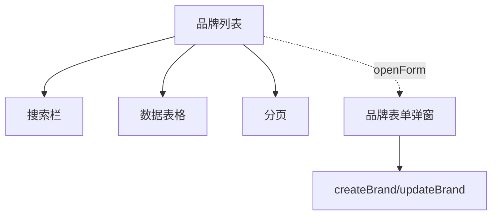
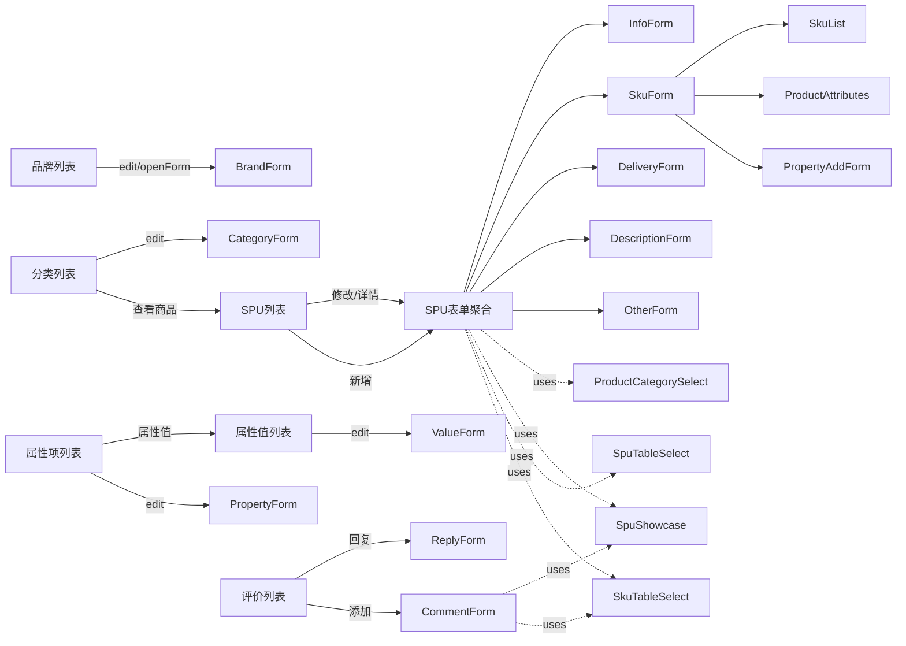

# UI 布局：商城商品中心 (yudao-ui-admin-vue3 / src/views/mall/product)

入口：frontend-mall-product · 模块：商城商品中心后台管理
源码范围：`src/views/mall/product/**` 全部 26 个文件，490 个原生节点，141 个可分析符号
证据：`evidence/frontend-mall-product/{inventory,nodes,typecards}.json`

本入口为后端 `yudao-module-mall/yudao-module-product` 模块的前端实现，涵盖品牌、商品分类、商品属性、商品评价、SPU/SKU 五大子域。所有页面均使用统一的"搜索栏 + 列表表格 + 表单弹窗"模式，权限点形如 `product:<resource>:<action>`。

---

## 商品品牌 (brand)

### 品牌列表 (`brand/index.vue`)

> 来源文件：`src/views/mall/product/brand/index.vue` · 置信度：0.92

[搜索栏]

- 字段 1：品牌名称（输入框，模糊搜索）
- 字段 2：状态（下拉选择，启用/禁用）
- 字段 3：创建时间（日期范围）
- 操作：搜索 / 重置 / **新增**（需 `product:brand:create`）

[数据表格]

- 列：品牌名称 / 品牌图片（缩略图）/ 品牌排序 / 开启状态 / 创建时间
- 行操作：**编辑**（需 `product:brand:update`）/ **删除**（需 `product:brand:delete`，二次确认）

[底部分页]

- 每页条数选择 + 页码跳转

[表单弹窗：BrandForm]

- 字段：品牌名称（必填）/ 品牌图片（必填，UploadImg）/ 品牌排序（必填）/ 品牌状态（单选）/ 品牌描述

**source_nodes**：`component:fbb82fd3451fdc7dcf941a9a95fdcb8b`（列表）、`component:2d7a9b88d8c6b9d362467ec2d6beba0e`（表单）、`function:983b518f40fda455789509dcb62ad231`（handleDelete）、`function:a7b69ca7e3cedfd7627766502b02168b`（getList）、`function:9d410f93c4e3fb316471e4011bc33645`（openForm）

---

### 品牌表单 (`brand/BrandForm.vue`)

Dialog 弹窗，承载新增/编辑。详见 typecards 节点 `component:2d7a9b88d8c6b9d362467ec2d6beba0e`。

---

## 商品分类 (category)

### 分类列表 (`category/index.vue`)

> 来源文件：`src/views/mall/product/category/index.vue` · 置信度：0.90

[搜索栏]

- 字段 1：分类名称（输入框）
- 操作：搜索 / 重置 / **新增**（需 `product:category:create`）

[数据表格]（树形，默认展开全部）

- 列：名称（min-width 240）/ 分类图标（缩略图）/ 排序 / 状态 / 创建时间
- 行操作：**编辑** / **查看商品**（仅二级分类，parentId > 0，需 `product:spu:query`，跳转 `ProductSpu?categoryId=`）/ **删除**（需 `product:category:delete`）

[表单弹窗：CategoryForm]

- 字段：上级分类（必填，可选顶级）/ 分类名称 / 移动端分类图（推荐 180x180）/ 分类排序 / 开启状态

**source_nodes**：`component:f69675a209b3865375b7e42f60c85466`、`component:415071f3d41649815096ab65c9a139f3`、`function:983b518f40fda455789509dcb62ad231`（handleDelete，跨页面同名）

### 分类选择器 (`category/components/ProductCategorySelect.vue`)

> 来源文件：`src/views/mall/product/category/components/ProductCategorySelect.vue` · 置信度：0.88

基于 el-tree-select 的封装，支持单/多选，受 `parentId` 控制根节点范围，通过 `v-model` 双向绑定。

**source_nodes**：`component:90f10902441d322000edf9da69f88370`

---

## 商品属性 (property)

### 属性项列表 (`property/index.vue`)

> 来源文件：`src/views/mall/product/property/index.vue` · 置信度：0.89

[搜索栏]

- 字段 1：属性名称 / 字段 2：创建时间
- 操作：搜索 / 重置 / **新增**（需 `product:property:create`）

[数据表格]

- 列：编号 / 属性名称 / 备注（tooltip）/ 创建时间
- 行操作：**编辑**（需 `product:property:update`）/ **属性值**（跳转属性值列表页 `/property/value?propertyId=`）/ **删除**

[表单弹窗：PropertyForm]

- 字段：名称（必填）/ 备注

**source_nodes**：`component:30b1c90977ec826a83ee2f1777895b5d`、`component:43ccda97fa2906aab36871cb7fca6606`、`function:9d410f93c4e3fb316471e4011bc33645`（goValueList，跳转）

### 属性值列表 (`property/value/index.vue`)

> 来源文件：`src/views/mall/product/property/value/index.vue` · 置信度：0.87

按 `propertyId` 路由参数过滤的属性值列表，结构与属性项列表类似。

- 搜索：属性项（禁用下拉，显示当前属性项）/ 名称
- 表格：编号 / 属性值名称 / 备注 / 创建时间
- 操作：编辑 / 删除（均需 `product:property:*`）
- 表单弹窗 ValueForm 包含 `propertyId`（外键）

**source_nodes**：`component:3c079e65e1a015eb488ef8ed4aebf6b6`、`component:1ba7f951ac58dcb25c3f4a691ecd155e`

---

## 商品评价 (comment)

### 评价列表 (`comment/index.vue`)

> 来源文件：`src/views/mall/product/comment/index.vue` · 置信度：0.90

[搜索栏]

- 字段 1：回复状态（已回复/未回复）/ 字段 2：商品名称 / 字段 3：用户名称 / 字段 4：订单编号 / 字段 5：评论时间区间
- 操作：搜索 / 重置 / **添加虚拟评论**（需 `product:comment:create`）

[数据表格]

- 列：评论编号 / 商品信息（封面+名称+规格 tag）/ 用户名称 / 商品评分（描述星）/ 服务评分（服务星）/ 评论内容（含图片缩略图，点击放大）/ 回复内容 / 评论时间 / **是否展示**（Switch 切换，需 `product:comment:update`）
- 行操作：**回复**（需 `product:comment:update`，弹出 ReplyForm）

[弹窗]

- CommentForm：含 SPU 展示选择 + SKU 表格选择 + 头像 + 昵称 + 评分 + 内容 + 图片（最多 9 张）
- ReplyForm：单字段回复内容

**source_nodes**：`component:8b462134c11b251f030d72d983c2b803`、`component:c60546efcc9ed0b1d4527bb2ee73663d`、`component:e3823f838eb365c67f0bd5c29489bd91`、`function:983b518f40fda455789509dcb62ad231`（handleVisibleChange，注意同名函数）

---

## SPU / SKU (spu)

### SPU 列表 (`spu/index.vue`)

> 来源文件：`src/views/mall/product/spu/index.vue` · 置信度：0.95

[搜索栏]

- 字段 1：商品名称 / 字段 2：商品分类（级联 el-cascader）/ 字段 3：创建时间
- 操作：搜索 / 重置 / **新增**（需 `product:spu:create`，跳 `/spu/form` 新建页）/ **导出**（需 `product:spu:export`）

[状态 Tab]

- 出售中（0）/ 仓库中（1）/ 已售罄（2）/ 警戒库存（3）/ 回收站（4），每 Tab 显示数量徽标

[数据表格]

- 列：商品编号 / 商品信息（封面+名称 tooltip）/ 价格（fenToYuan 分转元）/ 销量 / 库存 / 排序 / **销售状态**（Switch 上架/下架，仅 status >= 0 显示；status < 0 显示"回收站" tag）
- 行内：商品分类 / 市场价 / 成本价 / 浏览量 / 虚拟销量（展开行）
- 行操作：详情 / **修改** / **回收**（非回收站 Tab，移入回收站）/ **删除** + **恢复**（仅回收站 Tab）

[底部分页]

**source_nodes**：`component:766a92ffa67135de01a5219da9b57bf5`（SPU 列表）、`function:983b518f40fda455789509dcb62ad231`（handleDelete）、`function:983b518f40fda455789509dcb62ad231`（handleStatusChange）、`function:983b518f40fda455789509dcb62ad231`（handleStatus02Change）、`function:983b518f40fda455789509dcb62ad231`（handleExport，注意实际是不同函数但 nodes.json 中按 name 聚合显示）

### SPU 表单 (`spu/form/index.vue`)

> 来源文件：`src/views/mall/product/spu/form/index.vue` · 置信度：0.94

聚合 5 个 Tab 的复合表单，整体结构为"主 Tab + 子表单 + 统一保存"。

[主 Tab]

- **基础设置**（InfoForm）：商品名称（2 行 textarea，max 64 字）/ 商品分类（el-cascader，刷新按钮）/ 商品品牌（下拉+刷新）/ 关键字 / 简介（2 行，max 128）/ 封面图 / 轮播图
- **价格库存**（SkuForm）：分销类型（默认/单独）/ 规格类型（单/多） + 子组件 `SkuList` + 属性添加（多规格时）
- **物流设置**（DeliveryForm）：配送方式 / 运费模板 / 重量 / 体积
- **商品详情**（DescriptionForm）：富文本
- **其它设置**（OtherForm）：排序 / 赠送积分 / 虚拟销量

[底部操作]

- **保存**：依次校验所有子表单，组装 formData（分→元换算、SKU 命名、轮播图 URL 化），调 `createSpu` 或 `updateSpu`
- **返回**：delView + push 列表

**source_nodes**：`component:be487fd29883255ef6a9971a99c1c589`（SPU 表单聚合）、`component:68c9a279711c588e6c9f52ac19abc2be`（InfoForm）、`component:18a9cdf6cda3537530eea5e2dc6b6492`（SkuForm）、`component:13391245e64d2417c7bc0b6da4718a78`（DeliveryForm）、`component:7a6ff01634b3ee0a30a8a774844408c9`（DescriptionForm）、`component:70c3384cad029eedab3d527723aaebb4`（OtherForm）、`component:61fc70313ceef9ac0c4570dba9d9ac51`（ProductAttributes）、`component:58b810df1c6c35195b854d4b8e616178`（ProductPropertyAddForm）、`component:7e42462b163ba6dd1fd60611ebe27fc6`（SkuList）、`component:71096ed3227a58af4005a43b8f2b0711`（SkuTableSelect）、`component:e66cfb70aadcb8c836cba8d713911f31`（SpuShowcase）、`component:8aa636172dabd1f67e1b4ded472f0715`（SpuTableSelect）、`component:index.ts`（spu 子模块入口）

---

## 跨页面共用组件

- **ProductCategorySelect**（分类选择器）：树形单/多选
- **SkuList**（SKU 列表）：单/多规格表格编辑器，支持行内编辑、批量设置、SKU 组合自动生成
- **SkuTableSelect / SpuTableSelect**（SKU/SPU 表格选择器）：弹窗中按条件过滤选 SPU/SKU
- **SpuShowcase**（SPU 展示选择）：下拉中显示封面+名称的 SPU 选择器

**source_nodes**（共用）：`component:90f10902441d322000edf9da69f88370`、`component:7e42462b163ba6dd1fd60611ebe27fc6`、`component:71096ed3227a58af4005a43b8f2b0711`、`component:e66cfb70aadcb8c836cba8d713911f31`、`component:8aa636172dabd1f67e1b4ded472f0715`

---

## 整体页面关系图

**所有交互元素的完整 API 链路已在 typecards.json 的 `interactions` 数组中详细记录**。
