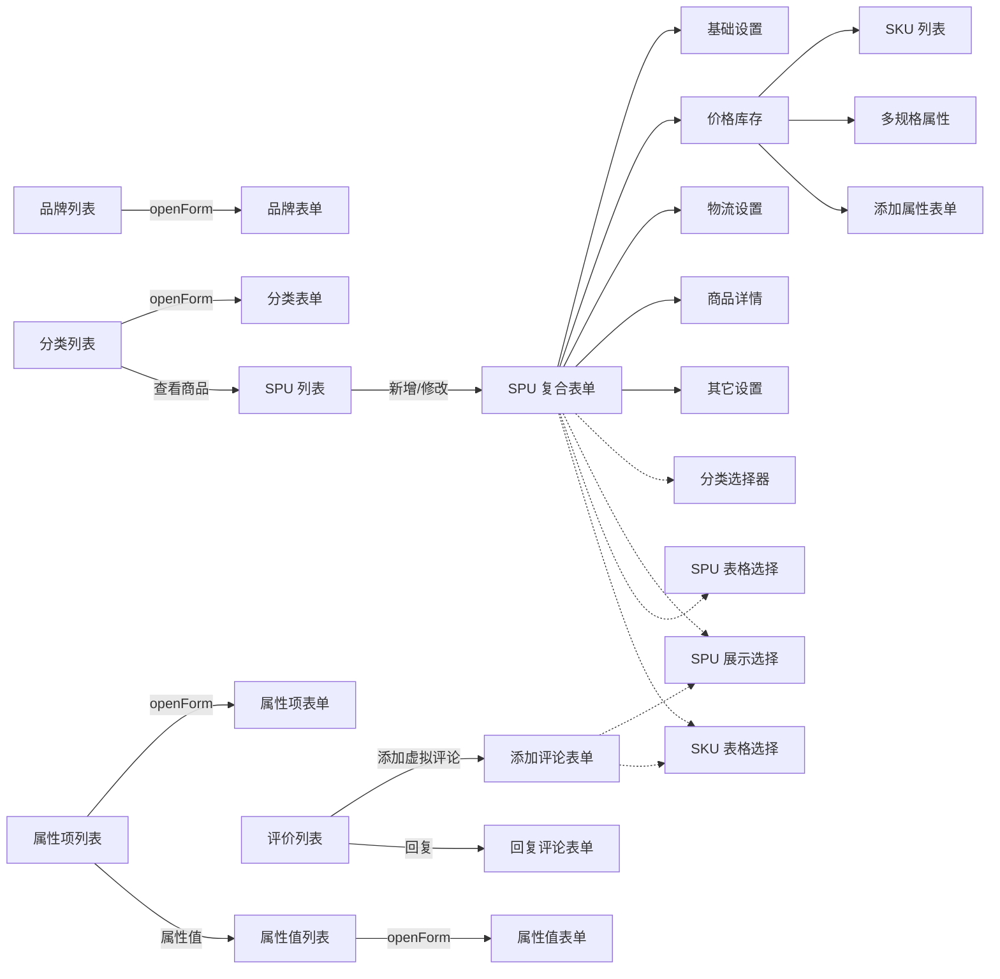
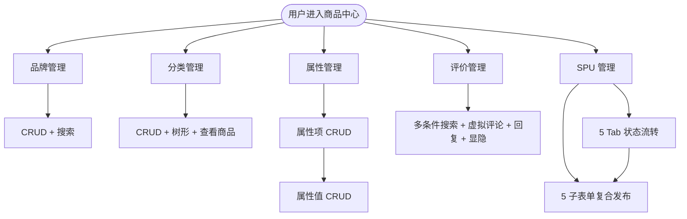

# 主业务流图：商城商品中心

入口：frontend-mall-product
证据：./entries/frontend-mall-product/business-flows.md

---

## 整体导航关系

---

## 5 子域聚合

---

## 关键流程编号

| 编号 | 流程 | 详细 |
|---|---|---|
| F1 | 品牌 CRUD | sequence-brand-crud.md |
| F2 | 分类树 CRUD | sequence-category-crud.md |
| F3 | 属性/属性值两级 | sequence-property-flow.md |
| F4 | 评价多条件管理 | sequence-comment-flow.md |
| F5 | SPU 5-Tab 状态流转 | sequence-spu-status.md |
| F6 | SPU 5-Tab 复合表单 | sequence-spu-form.md |
| F7 | 跨子域组件复用 | sequence-component-reuse.md |
