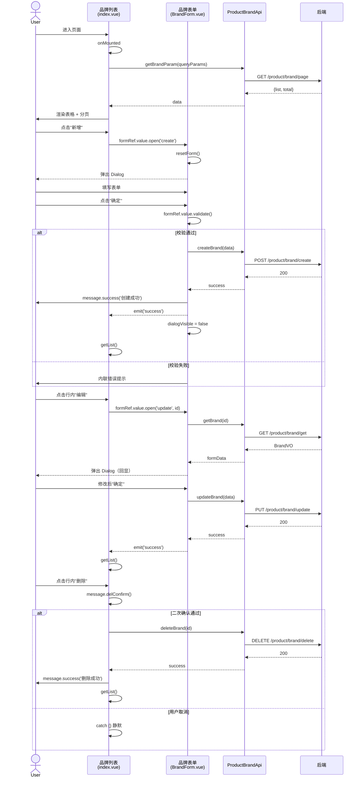

# 序列图 F1：品牌 CRUD

入口：brand/index.vue + brand/BrandForm.vue
源文件：src/views/mall/product/brand/index.vue, src/views/mall/product/brand/BrandForm.vue
source_nodes：component:fbb82fd3451fdc7dcf941a9a95fdcb8b, component:2d7a9b88d8c6b9d362467ec2d6beba0e

