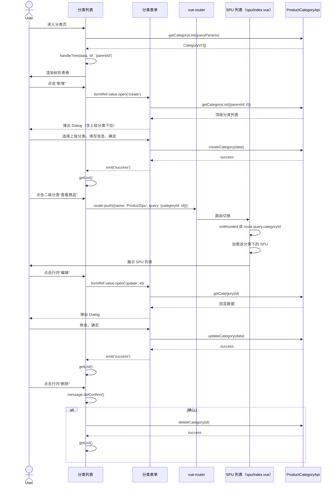

# 序列图 F2：分类树 CRUD（含跨入口跳转）

入口：category/index.vue + category/CategoryForm.vue
source_nodes：component:f69675a209b3865375b7e42f60c85466, component:415071f3d41649815096ab65c9a139f3

**关键跨入口调用**：`handleViewSpu` 触发 router.push 到 `ProductSpu`，将 `categoryId` 作为 query 传递。
