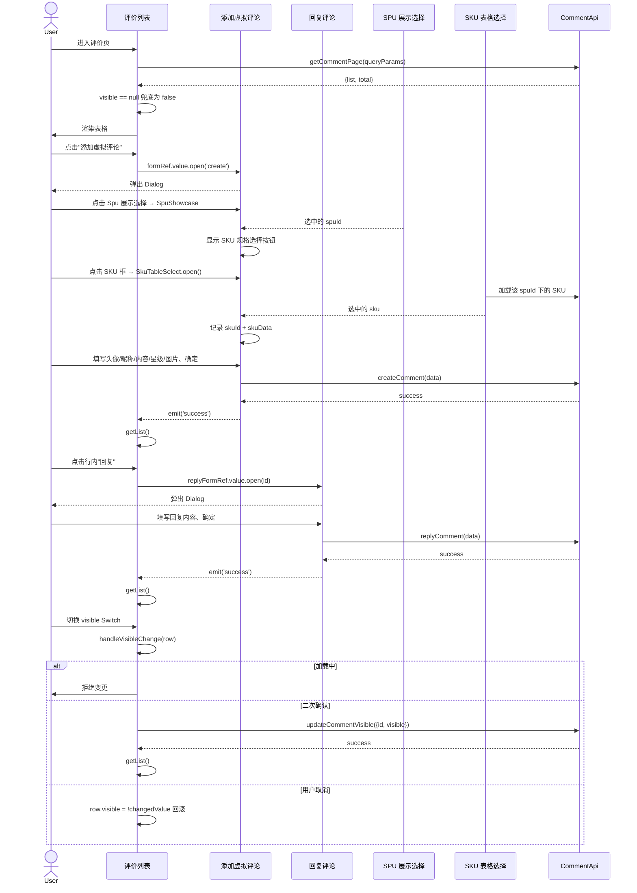

# 序列图 F4：评价多条件管理

入口：comment/index.vue + CommentForm.vue + ReplyForm.vue
source_nodes：component:8b462134c11b251f030d72d983c2b803, component:c60546efcc9ed0b1d4527bb2ee73663d, component:e3823f838eb365c67f0bd5c29489bd91

