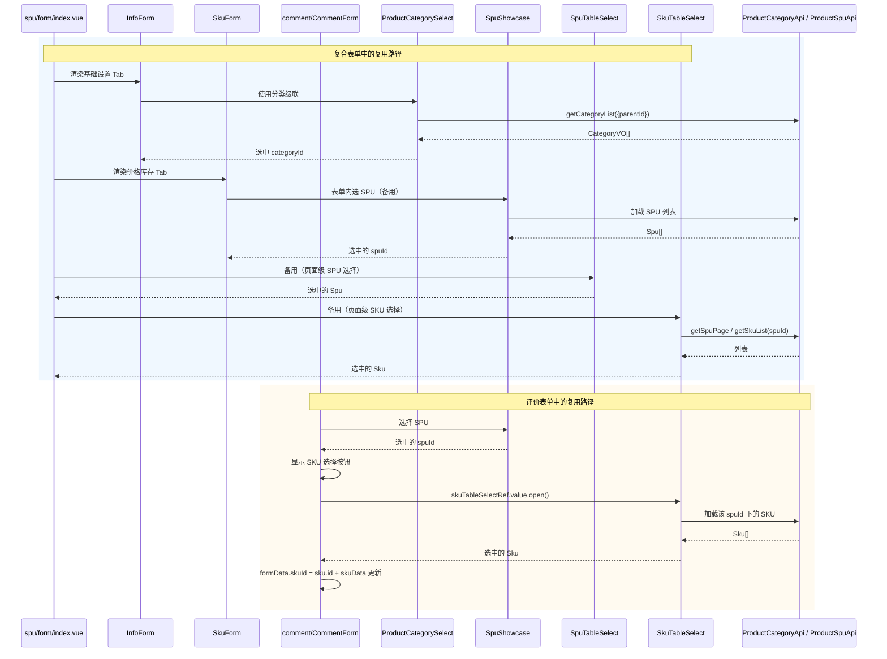

# 序列图 F7：跨子域 SPU/SKU 组件复用

入口：spu/components/* + comment/CommentForm.vue
source_nodes：component:e66cfb70aadcb8c836cba8d713911f31, component:8aa636172dabd1f67e1b4ded472f0715, component:71096ed3227a58af4005a43b8f2b0711, component:90f10902441d322000edf9da69f88370

