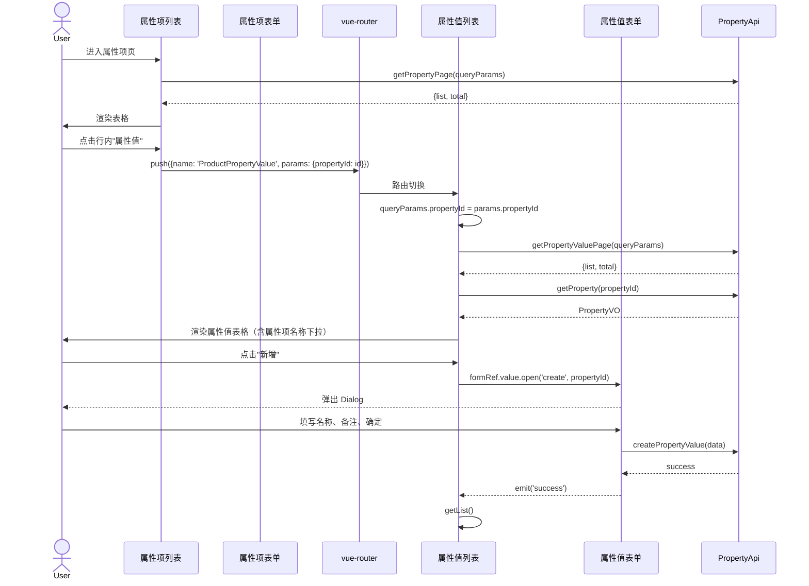

# 序列图 F3：属性/属性值两级管理

入口：property/index.vue + property/value/index.vue
source_nodes：component:30b1c90977ec826a83ee2f1777895b5d, component:43ccda97fa2906aab36871cb7fca6606, component:3c079e65e1a015eb488ef8ed4aebf6b6, component:1ba7f951ac58dcb25c3f4a691ecd155e

**关键设计**：propertyId 通过路由 params 传递，子页面通过 `getProperty(propertyId)` 单独加载属性项元信息（不会重复从父页传值）。
