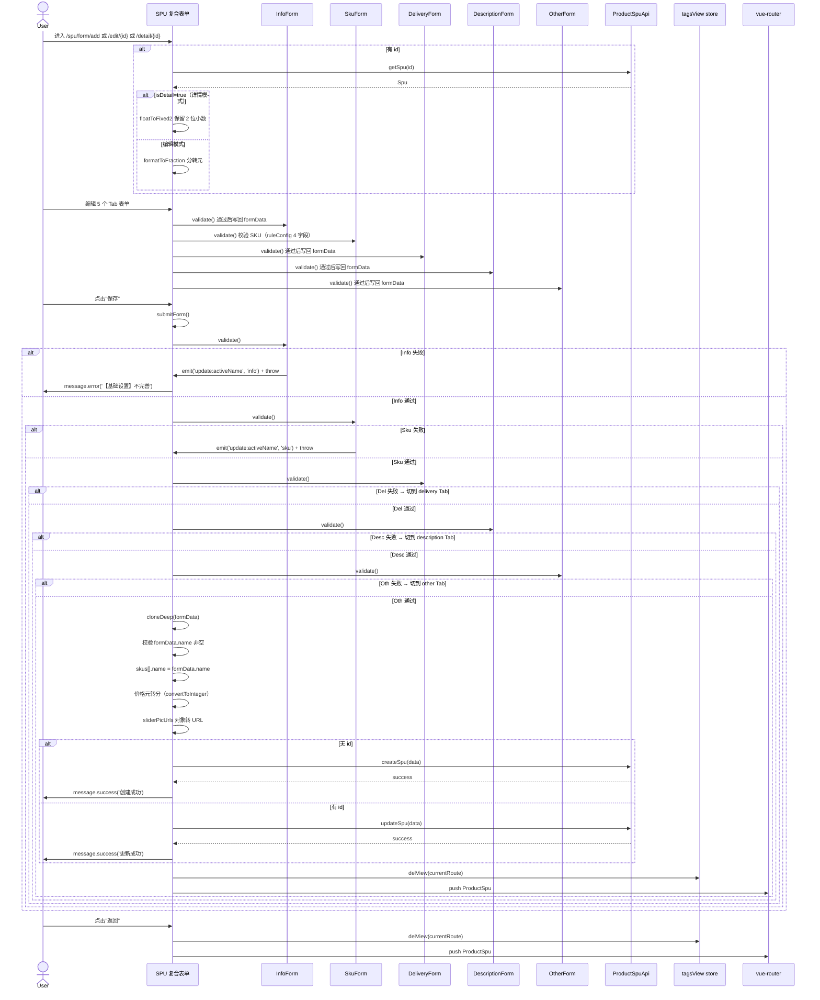

# 序列图 F6：SPU 5-Tab 复合表单提交

入口：spu/form/index.vue + 5 form 子组件
source_nodes：component:be487fd29883255ef6a9971a99c1c589, component:68c9a279711c588e6c9f52ac19abc2be, component:18a9cdf6cda3537530eea5e2dc6b6492, component:13391245e64d2417c7bc0b6da4718a78, component:7a6ff01634b3ee0a30a8a774844408c9, component:70c3384cad029eedab3d527723aaebb4, component:61fc70313ceef9ac0c4570dba9d9ac51, component:58b810df1c6c35195b854d4b8e616178

