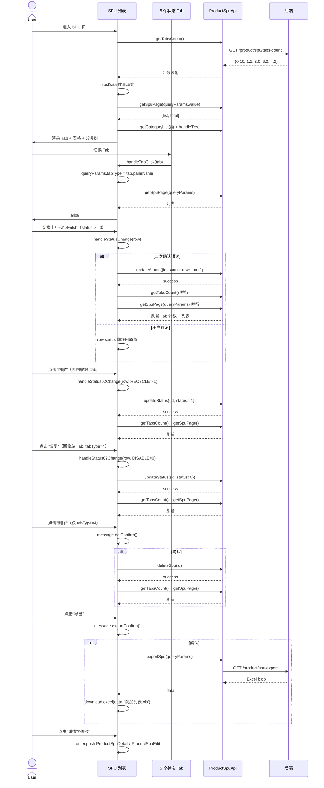

# 序列图 F5：SPU 5-Tab 状态流转

入口：spu/index.vue
source_nodes：component:766a92ffa67135de01a5219da9b57bf5, function:983b518f40fda455789509dcb62ad231（handleStatusChange/02Change/handleDelete/handleExport 聚合）

