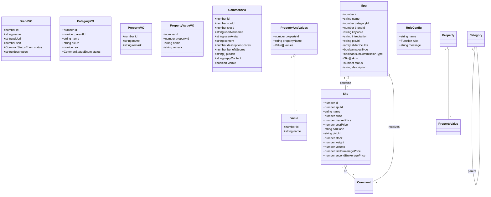

# 类体系：前端实体 TypeScript 类型

入口：所有 *Form.vue / index.vue 引用的 @/api/mall/product/* VO
source_nodes：interface 类型节点（2 个）+ 各 form 引用的 VO 类型

```mermaid
classDiagram
  class BrandVO {
    +number id
    +string name
    +string picUrl
    +number sort
    +CommonStatusEnum status
    +string description
  }
  class CategoryVO {
    +number id
    +number parentId
    +string name
    +string picUrl
    +number sort
    +CommonStatusEnum status
  }
  class PropertyVO {
    +number id
    +string name
    +string remark
  }
  class PropertyValueVO {
    +number id
    +number propertyId
    +string name
    +string remark
  }
  class CommentVO {
    +number id
    +number spuId
    +number skuId
    +string userNickname
    +string userAvatar
    +string content
    +number descriptionScores
    +number benefitScores
    +string[] picUrls
    +string replyContent
    +boolean visible
  }
  class Spu {
    +number id
    +string name
    +number categoryId
    +number brandId
    +string keyword
    +string introduction
    +string picUrl
    +array sliderPicUrls
    +boolean specType
    +boolean subCommissionType
    +Sku[] skus
    +number status
    +string description
  }
  class Sku {
    +number id
    +number spuId
    +string name
    +number price
    +number marketPrice
    +number costPrice
    +string barCode
    +string picUrl
    +number stock
    +number weight
    +number volume
    +number firstBrokeragePrice
    +number secondBrokeragePrice
  }
  class PropertyAndValues {
    +number propertyId
    +string propertyName
    +Value[] values
  }
  class Value {
    +number id
    +string name
  }
  class RuleConfig {
    +string name
    +Function rule
    +string message
  }

  Spu "1" o-- "*" Sku : contains
  Spu "1" o-- "*" Comment : receives
  Sku "1" o-- "*" Comment : on
  Property "1" o-- "*" PropertyValue
  Category "1" o-- "*" Category : parent
  PropertyAndValues "1" o-- "*" Value
```

详见 [data-model.md](../../data-model.md)
