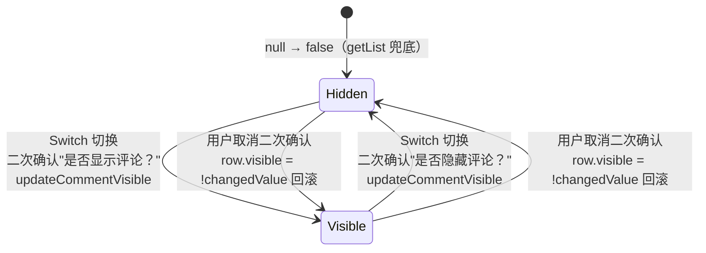

# 状态机：评论可见性

入口：comment/index.vue
source_nodes：component:8b462134c11b251f030d72d983c2b803, function:983b518f40fda455789509dcb62ad231（handleVisibleChange）

详见 [state-machines.md § 3](../../state-machines.md)
