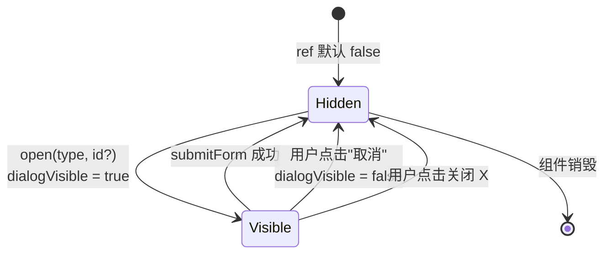

# 状态机：表单弹窗显隐

入口：所有 *Form.vue 组件
source_nodes：所有 dialogVisible 引用

详见 [state-machines.md § 2](../../state-machines.md)

**约束**：
- open 时必先 `resetForm()` 清空表单
- 若是 `type=update` 且 `id` 有值：调对应 API 加载数据
- submitForm 成功：emit('success')，弹窗关闭
