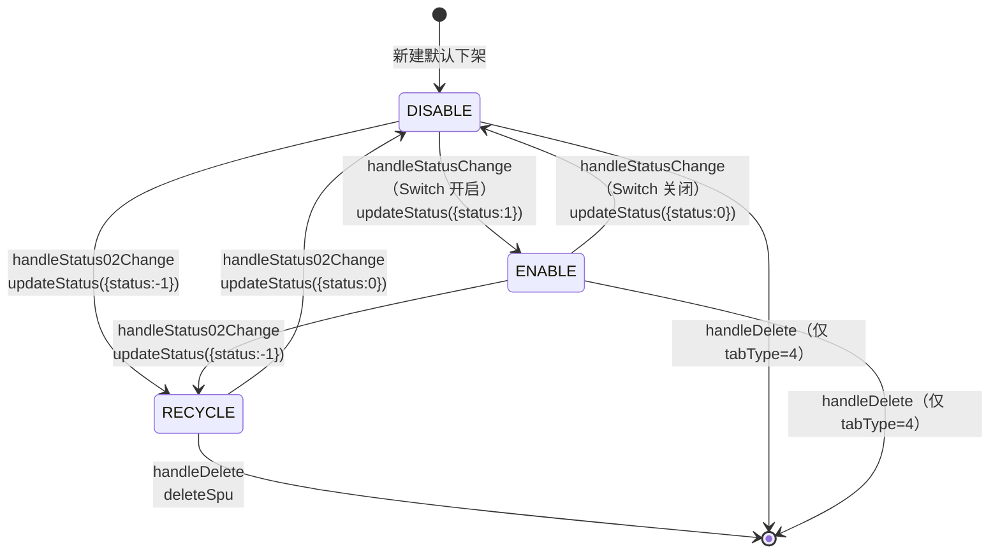

# 状态机：SPU 销售状态

入口：spu/index.vue
source_nodes：component:766a92ffa67135de01a5219da9b57bf5

详见 [state-machines.md § 1](../../state-machines.md)

**前端约束**：
- Switch 仅在 status >= 0 时显示；status < 0 显示"回收站" tag
- 回收/恢复操作按钮在非回收站 Tab 显示"回收"，在回收站 Tab 显示"删除+恢复"
- 异常时回滚 row.status 到原值
- 二次确认文案根据 newStatus 动态生成
