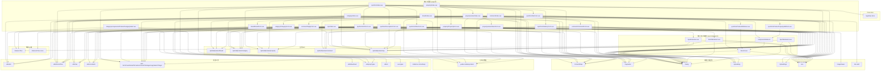

# 组件依赖图

入口：frontend-mall-product（单入口聚合）

```mermaid
graph TB
  subgraph "外部 UI 库"
    EP[Element Plus]
    Icons[Element Plus Icons]
  end

  subgraph "项目公共组件"
    CW[ContentWrap]
    Pag[Pagination]
    Dlg[Dialog]
    UpImg[UploadImg]
    UpImgs[UploadImgs]
    Ic[Icon]
    IV[ImageViewer]
    DA[doc-alert]
  end

  subgraph "项目工具"
    Dict[utils/dict]
    Fmt[utils/formatTime]
    Tree[utils/tree]
    Const[utils/constants]
    Util[utils - fenToYuan/formatToFraction/convertToInteger/copyValueToTarget]
    DL[utils/download]
    PT[utils/propTypes]
    Is[utils/is]
    VT[vue-types]
    Ld[lodash-es cloneDeep]
  end

  subgraph "Pinia store"
    TV[tagsView store]
  end

  subgraph "本入口页面 (page 层)"
    P1[brand/index.vue]
    P2[brand/BrandForm.vue]
    P3[category/index.vue]
    P4[category/CategoryForm.vue]
    P5[category/components/ProductCategorySelect.vue]
    P6[property/index.vue]
    P7[property/PropertyForm.vue]
    P8[property/value/index.vue]
    P9[property/value/ValueForm.vue]
    P10[comment/index.vue]
    P11[comment/CommentForm.vue]
    P12[comment/ReplyForm.vue]
    P13[spu/index.vue]
    P14[spu/form/index.vue]
    P15[spu/form/InfoForm.vue]
    P16[spu/form/SkuForm.vue]
    P17[spu/form/DeliveryForm.vue]
    P18[spu/form/DescriptionForm.vue]
    P19[spu/form/OtherForm.vue]
    P20[spu/form/ProductAttributes.vue]
    P21[spu/form/ProductPropertyAddForm.vue]
  end

  subgraph "本入口公共组件 (spu/components)"
    C1[SkuList.vue]
    C2[SkuTableSelect.vue]
    C3[SpuShowcase.vue]
    C4[SpuTableSelect.vue]
    C5[components/index.ts]
  end

  subgraph "业务 API"
    A1[api/mall/product/brand]
    A2[api/mall/product/category]
    A3[api/mall/product/property]
    A4[api/mall/product/comment]
    A5[api/mall/product/spu]
  end

  subgraph "后端 (外部)"
    BE[yudao-module-product]
  end

  P1 --> CW & Pag & Dlg & Ic & Dict & Fmt & DA
  P1 --> A1
  P1 --> P2

  P2 --> Dlg & UpImg & Dict & Const & A1

  P3 --> CW & Pag & Dlg & Ic & Dict & Fmt & Tree & A2
  P3 --> P4

  P4 --> Dlg & UpImg & Dict & Const & A2

  P5 --> EP & Tree & A2 & PT & VT

  P6 --> CW & Pag & Dlg & Ic & Fmt & A3
  P6 --> P7
  P6 --> P8

  P7 --> Dlg & A3
  P8 --> CW & Pag & Dlg & Ic & Fmt & A3
  P8 --> P9
  P9 --> Dlg & A3

  P10 --> CW & Pag & Dlg & Ic & Fmt & A4
  P10 --> P11
  P10 --> P12
  P11 --> Dlg & UpImg & UpImgs & C3 & C2 & A4 & A5
  P12 --> Dlg & EP & A4

  P13 --> CW & Pag & Ic & Fmt & Tree & Const & Util & DL & IV & A5 & A2
  P14 --> CW & Ic & Ld & Util & Is & A5
  P14 --> P15 & P16 & P17 & P18 & P19

  P15 --> Dlg & UpImg & UpImgs & Ic & Util & PT & Tree & A2 & A1 & Icons
  P16 --> Ic & Util & PT & C1 & C5 & P20 & P21
  P17 --> Dlg & Ic & Util & A5
  P18 --> Dlg & Util & A5
  P19 --> Dlg & Util & A5
  P20 --> C1
  P21 --> C5

  C1 --> Ic & Util
  C2 --> Dlg & Ic & A5
  C3 --> EP & Ic & A5
  C4 --> Dlg & Ic & A5
  C5 --> C1

  P14 --> TV
  A1 --> BE
  A2 --> BE
  A3 --> BE
  A4 --> BE
  A5 --> BE
```

**source_nodes**：所有 26 个 page/公共组件节点 + 入口 components/index.ts 节点
